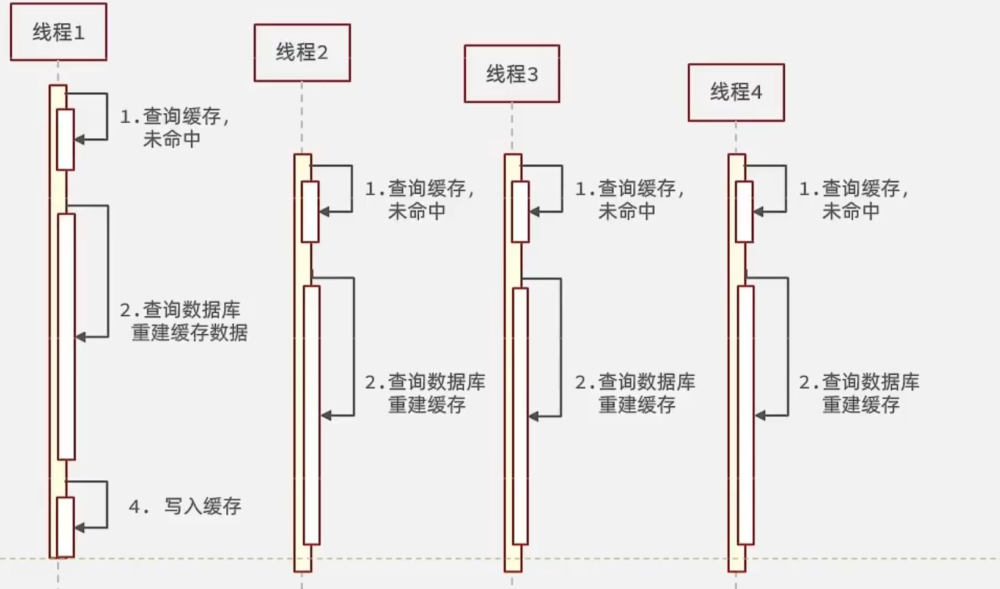
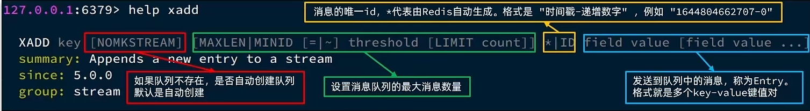

## 0、压力测试

cmd-->jmeter

1.添加线程组


2.添加http请求


3.需要登录授权的添加配置元件http状态头

可由浏览器发送获取


**批量生成token**

1.在userService加入，同时在接口加入方法

```java
public void generateToken() {

        String[] phoneNumbers = new String[1000];
        String prefix = "1345678";
        for (int i = 0; i < 1000; i++) {
            String suffixPhone = String.valueOf(9000 + i);
            phoneNumbers[i] = prefix+suffixPhone;
        }
        for(String phone : phoneNumbers){
            //一致根据手机号查用户
            User user = query().eq("phone", phone).one();
            if (user == null) {
                user = createUserWithPhone(phone);
            }
            //7.保存用户信息到redis----------------
            //7.1 随机生成Token作为登录令牌
            String token = UUID.randomUUID().toString();

            String filePath = "C:\\Users\\yanang\\Desktop\\hm_dianping\\output.txt";
            String content = token+'\n';
            // C:\Users\yanang\Desktop\hm_dianping
            try (FileWriter fileWriter = new FileWriter(filePath, true);
                 BufferedWriter bufferedWriter = new BufferedWriter(fileWriter)) {
                // 写入内容
                bufferedWriter.write(content);
                // 确保内容都已写入文件
                bufferedWriter.flush();
            }  catch (IOException e) {
                throw new RuntimeException(e);
            }
            //7.2 将User对象转为Hash存储
            UserDTO userDTO = BeanUtil.copyProperties(user, UserDTO.class);
            Map<String, Object> userMap = BeanUtil.beanToMap(userDTO,new HashMap<>(),
                    CopyOptions.create().setIgnoreNullValue(true)
                            .setFieldValueEditor((fieldName,fieldValue)->fieldValue.toString()));
            //7.3 存储
            stringRedisTemplate.opsForHash().putAll("login:token:"+token,userMap);
            //7.4设置token有效期
            String tokenKey = LOGIN_USER_KEY+token;
            stringRedisTemplate.expire(tokenKey,999999999,TimeUnit.MINUTES);
        }
    }
```

2.在controller加入，同时在拦截器对路径"/user/generateToken"放行

```java
@GetMapping("/generateToken")
public void generateToken(){
    userService.generateToken();
}
```

发送http://localhost:8080/api/user/generateToken即可

测试


## 1、项目部署

### 1.1、JDK修改

1、进入 **File** > **Project Structure** > **Project**,修改SDK

​	修改modules下的sources和dependencies的版本

2、


### 1.2、结构


### 1.3、数据库

创建数据库`hmdp`


### 1.4、后端启动

> 黑马点评完整版项目运行报错代码：
>
> ERROR 1712 --- [pool-2-thread-1] c.h.s.impl.VoucherOrderServiceImpl       : 处理订单异常
>
> java.lang.IllegalStateException: LettuceConnectionFactory was destroyed and cannot be used anymore
>
> 报错出现在项目启动，会反复循环报错
>
> 解决方法：执行下列代码，代码主要是项目在redis在启动的时候会去访问Redis，连接Redis的Stream

```
XGROUP CREATE stream.orders g1 $ MKSTREAM
```

> 连接数据库时报错，“Public Key Retrieval is not allowed”，
>
> 解决：在配置数据源的时候直接将属性allowPublicKeyRetrieval设置为true即可
>
> 参考：https://blog.csdn.net/white0718/article/details/131790493

```
url: jdbc:mysql://127.0.0.1:3306/hmdp?useSSL=false&allowPublicKeyRetrieval=true&serverTimezone=UTC
```

项目启动访问：http://localhost:8081/shop-type/list


### 1.4、运行前端项目


## 2、短信登录

### 2.1、基于session实现登录流程


> 校验登录状态时，保存用户到`threadlocal`是因为：多线程共享session域，存在线程安全问题，拷贝到`threadlocal`保证安全

### 2.2、发送短信验证码

UserController 下调用 UserService, UserService实现该方法

```java
public Result sendCode(String phone, HttpSession session) {
        //  验证手机号
        if (RegexUtils.isPhoneInvalid(phone)){
            return Result.fail("无效手机号");
        }
        //  生成校验码
        String code = RandomUtil.randomNumbers(6);
        // 保存到session
        session.setAttribute("code",code);
        // 发送验证码
        log.debug("发送验证码：{}", code);

        return Result.ok();
    }
```

### 2.3、登录

```java
public Result login(LoginFormDTO loginForm, HttpSession session) {
        // 1.校验手机号
        String phone = loginForm.getPhone();
        if (RegexUtils.isPhoneInvalid(phone)){
            return Result.fail("无效手机号");
        }
        // 2.校验验证码
        Object cacheCode = session.getAttribute("code");
        String code = loginForm.getCode();
        if (cacheCode == null || !cacheCode.toString().equals(code)) {
            return Result.fail("验证码不正确");
        }
        // 3.查询用户
        User user = query().eq("phone",phone).one(); //mybatis-plus
        // 4.判断用户是否存在
        if (user == null) {
            user = createUserWithPhone(phone);
        }
        // 5.用户保存到session
        session.setAttribute("user",user);

        return Result.ok();
    }

    private User createUserWithPhone(String phone) {
        User user = new User();
        user.setPhone(phone);
        user.setNickName(USER_NICK_NAME_PREFIX+RandomUtil.randomString(10));
        save(user);
        return user;
    }
```

### 2.4、登录拦截

- tomcat（pring Boot 默认使用内嵌 Tomcat 作为其 Web 服务器）


> 当用户发起请求时，会访问我们像tomcat注册的端口，任何程序想要运行，都需要有一个线程对当前端口号进行监听，tomcat也不例外，当监听线程知道用户想要和tomcat连接连接时，那会由监听线程创建socket连接，socket都是成对出现的，用户通过socket像互相传递数据，当tomcat端的socket接受到数据后，此时监听线程会从tomcat的线程池中取出一个线程执行用户请求，在我们的服务部署到tomcat后，线程会找到用户想要访问的工程，然后用这个线程转发到工程中的controller，service，dao中，并且访问对应的DB，在用户执行完请求后，再统一返回，再找到tomcat端的socket，再将数据写回到用户端的socket，完成请求和响应
>
> 通过以上讲解，我们可以得知 每个用户其实对应都是去找tomcat线程池中的一个线程来完成工作的， 使用完成后再进行回收，既然每个请求都是独立的，所以在每个用户去访问我们的工程时，我们可以使用threadlocal来做到线程隔离，每个线程操作自己的一份数据

- threadlocal

> 在threadLocal中，无论是他的put方法和他的get方法， 都是先从获得当前用户的线程，然后从线程中取出线程的成员变量map，只要线程不一样，map就不一样，所以可以通过这种方式来做到线程隔离
>

- 登录验证


LoginInterceptor

> 注意，此时UserHolder的线程泛型应该为User 而非UserDto

```java
public class LoginInterceptor implements HandlerInterceptor {
    @Override
    public boolean preHandle(HttpServletRequest request, HttpServletResponse response, Object handler) throws Exception {
        //1.获取session
        HttpSession session = request.getSession();
        // 2.获取用户
        Object user = session.getAttribute("user");
        // 3.判断用户是否存在
        if (user == null) {
            // 用户无效返回401
            response.setStatus(401);
            return false;
        }
        // 用户存在，保存到threadlocal
        UserHolder.saveUser((User) user);
        // 5. 放行
        return true;
    }

    @Override
    public void afterCompletion(HttpServletRequest request, HttpServletResponse response, Object handler, Exception ex) throws Exception {
        UserHolder.removeUser(); //移除
    }
}
```

拦截器配置MvcConfig

```java
@Configuration
public class MvcConfig implements WebMvcConfigurer {


    @Override
    public void addInterceptors(InterceptorRegistry registry) {

        registry.addInterceptor(new LoginInterceptor())
                .excludePathPatterns(
                        "/shop/**",
                        "/voucher/**",
                        "/shop-type/**",
                        "/upload/**",
                        "/blog/hot",
                        "/user/code",
                        "/user/login"
                ).order(1);
    }
}
```

### 2.5、信息保护

登录存入session的用户User,保存信息 过于完整，容易产生信息泄露，改为存入UserDTO,仅存入少量信息，减少内存，且保证安全

在service的login方法出修改

```java
session.setAttribute("user", BeanUtil.copyProperties(user, UserDTO.class));
```

UserHolder的线程泛型改为UserDto

### 2.6、redis代替session

> 每个tomcat中都有一份属于自己的session,假设用户第一次访问第一台tomcat，并且把自己的信息存放到第一台服务器的session中，但是第二次这个用户访问到了第二台tomcat，那么在第二台服务器上，肯定没有第一台服务器存放的session，所以此时 整个登录拦截功能就会出现问题，我们能如何解决这个问题呢？早期的方案是session拷贝，就是说虽然每个tomcat上都有不同的session，但是每当任意一台服务器的session修改时，都会同步给其他的Tomcat服务器的session，这样的话，就可以实现session的共享了
>
> 但是这种方案具有两个大问题
>
> 1、每台服务器中都有完整的一份session数据，服务器压力过大。
>
> 2、session拷贝数据时，可能会出现延迟
>
> 所以咱们后来采用的方案都是基于redis来完成，我们把session换成redis，redis数据本身就是共享的，就可以避免session共享的问题了


1.service层修改sendCode 方法：

原本保存到session的code改为保存到redis

```java
// 保存到redis,采用string类型
stringRedisTemplate.opsForValue().set(LOGIN_CODE_KEY,code,LOGIN_CODE_TTL, TimeUnit.MINUTES);
```

2..service层修改login方法：

```java
public Result login(LoginFormDTO loginForm, HttpSession session) {
    // 1.校验手机号
    String phone = loginForm.getPhone();
    if (RegexUtils.isPhoneInvalid(phone)){
        return Result.fail("无效手机号");
    }
    // 2.校验验证码
    String cacheCode = stringRedisTemplate.opsForValue().get(LOGIN_CODE_KEY + phone);
    String code = loginForm.getCode();

    if (cacheCode == null || !cacheCode.equals(code)) {
        return Result.fail("验证码不正确");
    }
    // 3.查询用户
    User user = query().eq("phone",phone).one(); //mybatis-plus
    // 4.判断用户是否存在
    if (user == null) {
        user = createUserWithPhone(phone);
    }
    // 5.用户保存到redis
    // 5.1 保存到redis的key
    String token = UUID.randomUUID().toString();
    // 5.2 将user转为hashmap
    UserDTO userDTO = BeanUtil.copyProperties(user, UserDTO.class);
    // 采用的是StringRedisTemplate，采用hash数据类型因此存入的map的值应该为string，原先的fieldValue有一个id为long型，应改为string
    Map<String, Object> userMap = BeanUtil.beanToMap(userDTO, new HashMap<>(),
                                                     CopyOptions.create().
                                                     setIgnoreNullValue(true).
                                                     setFieldValueEditor((fieldName, fieldValue) -> fieldValue.toString()));
    // 5.3 存入
    stringRedisTemplate.opsForHash().putAll(LOGIN_USER_KEY+token,userMap);
    // 存入的用户userDTO设置过期时间，长时间无操作，从redis移除，减少存储压力
    stringRedisTemplate.expire(LOGIN_USER_KEY+token,LOGIN_USER_TTL,TimeUnit.SECONDS);

    // 6.token 返回
    return Result.ok(token);
}
```

3.LoginInterceptor

> 每次的登录验证拦截发生时，都证明当前用户处于活跃状态，应该不断刷新其`过期时间`

```java
private StringRedisTemplate stringRedisTemplate;
// loginInterceptor 是在MvcConfig 手动创建的，因此无法使用resource注解

public LoginInterceptor(StringRedisTemplate stringRedisTemplate) {
    this.stringRedisTemplate = stringRedisTemplate;
}

@Override
public boolean preHandle(HttpServletRequest request, HttpServletResponse response, Object handler) throws Exception {
    //1.从原先的从请求头获取session，从session获取用户
    // 改为从请求头获取token,根据token从redis获取用户
    String token = request.getHeader("authorization"); //前端约定为authorization
    // 2.获取用户 , entires方法放回整个map
    Map<Object, Object> userMap = stringRedisTemplate.opsForHash().entries(RedisConstants.LOGIN_USER_KEY + token);
    // 3.判断用户是否存在
    if (userMap.isEmpty()) {
        // 用户无效返回401
        response.setStatus(401);
        return false;
    }
    // 4.用户存在，从map转回UserDTO保存到threadlocal
    UserDTO userDTO = BeanUtil.fillBeanWithMap(userMap, new UserDTO(), false);
    UserHolder.saveUser(userDTO);
    // 5. 再次刷新过期时间
    stringRedisTemplate.expire(RedisConstants.LOGIN_USER_KEY + token,RedisConstants.LOGIN_USER_TTL, TimeUnit.SECONDS);
    
    return true;
}
```

### 2.7、拦截器优化

> 既然之前的拦截器无法对不需要拦截的路径生效，那么我们可以添加一个拦截器，在第一个拦截器中拦截所有的路径，把第二个拦截器做的事情放入到第一个拦截器中，同时刷新令牌，因为第一个拦截器有了threadLocal的数据，所以此时第二个拦截器只需要判断拦截器中的user对象是否存在即可，完成整体刷新功能。


- LoginInterceptor

```java
// 仅有
public boolean preHandle(HttpServletRequest request, HttpServletResponse response, Object handler)  {
    // 判断是否需要拦截（ThreadLocal中是否有用户）
    if (UserHolder.getUser() == null) {
        response.setStatus(401);
        return false;
    }
    return true;
}
```

- RefreshTokenInterceptor

```java
public class RefreshTokenInterceptor implements HandlerInterceptor {

    private StringRedisTemplate stringRedisTemplate;
    // loginInterceptor 是在MvcConfig 手动创建的，因此无法使用resource注解
    public RefreshTokenInterceptor(StringRedisTemplate stringRedisTemplate) {
        this.stringRedisTemplate = stringRedisTemplate;
    }

    @Override
    public boolean preHandle(HttpServletRequest request, HttpServletResponse response, Object handler) throws Exception {
        //1.从原先的从请求头获取session，从session获取用户
        // 改为从请求头获取token,根据token从redis获取用户
        String token = request.getHeader("authorization"); //前端约定为authorization
        if (StringUtil.isNullOrEmpty(token)) {
            return true;
        }
        // 2.获取用户 , entires方法放回整个map
        Map<Object, Object> userMap = stringRedisTemplate.opsForHash().entries(RedisConstants.LOGIN_USER_KEY + token);
        // 3.判断用户是否存在
        if (userMap.isEmpty()) {
            return true;
        }
        // 4.用户存在，从map转回UserDTO保存到threadlocal
        UserDTO userDTO = BeanUtil.fillBeanWithMap(userMap, new UserDTO(), false);
        UserHolder.saveUser(userDTO);
        // 5. 再次刷新过期时间
        stringRedisTemplate.expire(RedisConstants.LOGIN_USER_KEY + token,RedisConstants.LOGIN_USER_TTL, TimeUnit.SECONDS);
        return true;
    }

    @Override
    public void afterCompletion(HttpServletRequest request, HttpServletResponse response, Object handler, Exception ex) throws Exception {
        UserHolder.removeUser(); //移除
    }
}
```

## 3、缓存

### 3.1、商户缓存


ShopController调用ShopServicel的queryById,注意无效再包装Result

```java
@GetMapping("/{id}")
public Result queryShopById(@PathVariable("id") Long id) {
    return shopService.queryById(id);
}
```


- ShopServiceImpl

  ```java
  public Result queryById(Long id) {
      // 1. 根据KEY从redis查找商户,采用string数据类型
      String key = CACHE_SHOP_KEY + id;
      String shopJson = stringRedisTemplate.opsForValue().get(key);
      // 2.判断是否存在redis
      if (StrUtil.isNotBlank(shopJson)) {
          // 存在
          Shop shop = JSONUtil.toBean(shopJson, Shop.class);
          return Result.ok(shop);
      }
      // 3.不存在，则查找数据库
      Shop shop = getById(id);
      // 4. 数据库不存在
      if (shop == null) {
          return Result.fail("商铺不存在！");
      }
      // 5.存在，写回Redis
      stringRedisTemplate.opsForValue().set(key,JSONUtil.toJsonStr(shop));
  
      // 6.返回
      return Result.ok(shop);
  }
  ```

  

### 3.2、缓存更新策略

> 缓存更新是redis为了节约内存而设计出来的一个东西，主要是因为内存数据宝贵，当我们向redis插入太多数据，此时就可能会导致缓存中的数据过多，所以redis会对部分数据进行更新，或者把他叫为淘汰更合适。


#### 2.3.1 、数据库缓存不一致解决方案

> 由于我们的**缓存的数据源来自于数据库**,而数据库的**数据是会发生变化的**,因此,如果当数据库中**数据发生变化,而缓存却没有同步**,此时就会有**一致性问题存在**


#### 2.3.2 、数据库和缓存不一致采用什么方案

综合考虑使用方案一，但是方案一调用者如何处理呢？这里有几个问题

操作缓存和数据库时有三个问题需要考虑：


如果采用第一个方案，那么假设我们每次操作数据库后，都操作缓存，但是中间如果没有人查询，那么这个更新动作实际上只有最后一次生效，中间的更新动作意义并不大，我们可以把缓存删除，等待再次查询时，将缓存中的数据加载出来

* 删除缓存还是更新缓存？
  * 更新缓存：每次更新数据库都更新缓存，无效写操作较多——×
  * 删除缓存：更新数据库时让缓存失效，查询时再更新缓存——√

* 如何保证缓存与数据库的操作的同时成功或失败？
  * 单体系统，将缓存与数据库操作放在一个事务
  * 分布式系统，利用TCC等分布式事务方案

应该具体操作缓存还是操作数据库？

我们应当是先操作数据库，再删除缓存，原因在于，如果你选择第一种方案，在两个线程并发来访问时，假设线程1先来，他先把缓存删了，此时线程2过来，他查询缓存数据并不存在，此时他写入缓存，当他写入缓存后，线程1再执行更新动作时，实际上写入的就是旧的数据，新的数据被旧数据覆盖了。

* 先操作缓存还是先操作数据库？
  * 先删除缓存，再操作数据库
  * 先操作数据库，再删除缓存


### 3.3、实现商铺和缓存与数据库双写一致

核心思路如下：

修改ShopController中的业务逻辑，满足下面的需求：

根据id查询店铺时，如果缓存未命中，则查询数据库，将数据库结果写入缓存，并设置超时时间

根据id修改店铺时，先修改数据库，再删除缓存

- 修改**ShopServiceImpl**的queryById方法

```java
stringRedisTemplate.opsForValue().set(key,JSONUtil.toJsonStr(shop),CACHE_SHOP_TTL, TimeUnit.MINUTES);
```

- **ShopServiceImpl**的updata，由controller来调用

```java
public Result update(Shop shop) {

    Long id = shop.getId();
    if (id == null) {
        return Result.fail("商户id为空！");
    }
    // 先更新数据库
    updateById(shop);
    // 后删除缓存
    stringRedisTemplate.delete(CACHE_SHOP_KEY + id);

    return Result.ok();
}
```

- 测试

修改商户信息暂时采用postman,发生put到http://localhost:8081/shop，完成商户的更新操作

```java
{
    "area": "大关",
    "openHours": "10:00-22:00",
    "sold": 4215,
    "address": "金华路锦昌文华苑29号",
    "comments": 3035,
    "avgPrice": 80,
    "score": 37,
    "name": "猫猫茶餐厅",
    "typeId": 1,
    "id": 1
}
```

### 3.4、缓存穿透

**缓存空对象思路分析：**当我们客户端访问不存在的数据时，先请求redis，但是此时redis中没有数据，此时会访问到数据库，但是数据库中也没有数据，这个数据穿透了缓存，直击数据库，我们都知道数据库能够承载的并发不如redis这么高，如果大量的请求同时过来访问这种不存在的数据，这些请求就都会访问到数据库，简单的解决方案就是哪怕这个数据在数据库中也不存在，我们也把这个数据存入到redis中去，这样，下次用户过来访问这个不存在的数据，那么在redis中也能找到这个数据就不会进入到缓存了


**布隆过滤：**布隆过滤器其实采用的是哈希思想来解决这个问题，通过一个庞大的二进制数组，走哈希思想去判断当前这个要查询的这个数据是否存在，如果布隆过滤器判断存在，则放行，这个请求会去访问redis，哪怕此时redis中的数据过期了，但是数据库中一定存在这个数据，在数据库中查询出来这个数据后，再将其放入到redis中，

假设布隆过滤器判断这个数据不存在，则直接返回

这种方式优点在于节约内存空间，存在误判，误判原因在于：布隆过滤器走的是哈希思想，只要哈希思想，就可能存在哈希冲突


- 修改ShopServiceImpl来避免缓存穿透，采用缓存空对象的方法


### 3.5、缓存雪崩问题及解决思路

缓存雪崩是指在同一时段大量的缓存key同时失效或者Redis服务宕机，导致大量请求到达数据库，带来巨大压力。

解决方案：

* 给不同的Key的TTL添加随机值
* 利用Redis集群提高服务的可用性
* 给缓存业务添加降级限流策略
* 给业务添加多级缓存

### 3.6、缓存击穿问题及解决思路

缓存击穿问题也叫热点Key问题，就是一个被高并发访问并且缓存重建业务较复杂的key突然失效了，无数的请求访问会在瞬间给数据库带来巨大的冲击。

逻辑分析：假设线程1在查询缓存之后，本来应该去查询数据库，然后把这个数据重新加载到缓存的，此时只要线程1走完这个逻辑，其他线程就都能从缓存中加载这些数据了，但是假设在线程1没有走完的时候，后续的线程2，线程3，线程4同时过来访问当前这个方法， 那么这些线程都不能从缓存中查询到数据，那么他们就会同一时刻来访问查询缓存，都没查到，接着同一时间去访问数据库，同时的去执行数据库代码，对数据库访问压力过大



常见的解决方案有两种：

* 互斥锁
* 逻辑过期


### 3.7、利用互斥锁解决缓存击穿问题


**操作锁的代码：**

核心思路就是利用redis的setnx方法来表示获取锁，该方法含义是redis中如果没有这个key，则插入成功，返回1，在stringRedisTemplate中返回true，  如果有这个key则插入失败，则返回0，在stringRedisTemplate返回false，我们可以通过true，或者是false，来表示是否有线程成功插入key，成功插入的key的线程我们认为他就是获得到锁的线程。

```java
private boolean trylock(String key){
    // 采用setnx,value任意，同时设置过期时间，防止线程意外导致锁无法释放，避免死锁
    Boolean flag = stringRedisTemplate.opsForValue().setIfAbsent(key, "1", 10, TimeUnit.SECONDS);
    // Boolean是一个包装类，采用BooleanUtil的工具类来转化为bool数据类型，可以防止空指针异常。
    return BooleanUtil.isTrue(flag);
}
private void unlock(String key){
    // 手动释放锁
    stringRedisTemplate.delete(key);
}
```

- **ShopServiceImpl**

```java
public Shop queryWithPassMutex(Long id){
    // 1. 根据KEY从redis查找商户,采用string数据类型
    String key = CACHE_SHOP_KEY + id;
    String shopJson = stringRedisTemplate.opsForValue().get(key);
    // 2.判断是否存在redis
    if (StrUtil.isNotBlank(shopJson)) {
        // 存在
        return JSONUtil.toBean(shopJson, Shop.class);
    }
    // 判断是否为空字符串
    if (shopJson != null) {
        return null;
    }
    // 3.实现缓存重构
    // 3.1 获取锁
    String lockKey = LOCK_SHOP_KEY +id;
    Shop shop = null;
    try {
        boolean islock = trylock(lockKey);
        // 3.2判断锁是否获取成功
        if(!islock){
            // 3.3失败，休眠重试
            Thread.sleep(100);
            queryWithPassMutex(id);
        }
        // 3.4 成功根据id 查数据库
        shop = getById(id);
        // 4. 数据库不存在
        if (shop == null) {
            stringRedisTemplate.opsForValue().set(key,"",CACHE_NULL_TTL, TimeUnit.MINUTES);
            return null;
        }
        // 5.存在，写回Redis
        stringRedisTemplate.opsForValue().set(key,JSONUtil.toJsonStr(shop),CACHE_SHOP_TTL, TimeUnit.MINUTES);
    } catch (InterruptedException e) {
        throw new RuntimeException(e);
    } finally {
        unlock(lockKey);
    }
    // 6.返回
    return shop;
}
```

###  3.8、利用逻辑过期解决缓存击穿问题

**需求：修改根据id查询商铺的业务，基于逻辑过期方式来解决缓存击穿问题**

思路分析：当用户开始查询redis时，判断是否命中，如果没有命中则直接返回空数据（存入的KEY没有过期时间，key正确的话，查询必定命中），不查询数据库，而一旦命中后，将value取出，判断value中的过期时间是否满足，如果没有过期，则直接返回redis中的数据，如果过期，则在开启独立线程后直接返回之前的数据，独立线程去重构数据，重构完成后释放互斥锁。


如果封装数据：因为现在redis中存储的数据的value需要带上过期时间，此时要么你去修改原来的实体类，要么你

**步骤一、**

新建一个实体类，我们采用第二个方案，这个方案，对原来代码没有侵入性。

```
@Data
public class RedisData {
    private LocalDateTime expireTime;
    private Object data;
}
```

**步骤二、**

在**ShopServiceImpl** 新增此方法，利用单元测试进行缓存预热

```java
// 把包装了逻辑过期时间的shop（redisData）保存到redis中
public void saveShop2Redis(Long id,Long expireSecond){
    // 1.查询商户数据
    Shop shop = getById(id);
    // 2.封装逻辑过期数据
    RedisData redisData = new RedisData();
    redisData.setData(shop);
    redisData.setExpireTime(LocalDateTime.now().plusSeconds(expireSecond));
    // 3.写入redis
    stringRedisTemplate.opsForValue().set(CACHE_SHOP_KEY+id,JSONUtil.toJsonStr(redisData));
}
```

在测试类中

```java
@Test
void testSaveShop(){
    shopService.saveShop2Redis(1L,10L);
}
```

 **步骤三：正式代码**

**ShopServiceImpl**

```java
// 线程池
private static final ExecutorService CACHE_REBUILD_EXECUTOR = Executors.newFixedThreadPool(10);
```

```java
public Shop queryWithLogicalExpire(Long id){
    // 1. 根据KEY从redis查找商户,采用string数据类型
    String key = CACHE_SHOP_KEY + id;
    String shopJson = stringRedisTemplate.opsForValue().get(key);
    // 2.判断是否存在redis
    if (StrUtil.isBlank(shopJson)) {
        // 不存在
        return null;
    }
    // 3.命中，把json对象反序列化为对象
    RedisData redisData = JSONUtil.toBean(shopJson, RedisData.class);
    JSONObject data = (JSONObject) redisData.getData();
    Shop shop = JSONUtil.toBean(data, Shop.class);
    LocalDateTime expireTime = redisData.getExpireTime();

    // 4.判断是否过期
    if (expireTime.isAfter(LocalDateTime.now())){
        // 4.1 未过期
        return shop;
    }
    // 4.2 过期缓存重建
    // 4.2.1获取互斥锁
    if (trylock(LOCK_SHOP_KEY+id)) {
        // 获取锁成功
        CACHE_REBUILD_EXECUTOR.submit(()->{

            try {
                // 缓存重建
                this.saveShop2Redis(id,20L);
            } catch (Exception e) {
                throw new RuntimeException(e);
            } finally {
                unlock(LOCK_SHOP_KEY+id);
            }
        });
    }
    // 6.返回过期的商户信息
    return shop;
}
```

### 3.9、封装Redis工具类（泛型）

基于StringRedisTemplate封装一个缓存工具类，满足下列需求：

* 方法1：将任意Java对象序列化为json并存储在string类型的key中，并且可以设置TTL过期时间
* 方法2：将任意Java对象序列化为json并存储在string类型的key中，并且可以设置逻辑过期时间，用于处理缓

存击穿问题

* 方法3：根据指定的key查询缓存，并反序列化为指定类型，利用缓存空值的方式解决缓存穿透问题
* 方法4：根据指定的key查询缓存，并反序列化为指定类型，需要利用逻辑过期解决缓存击穿问题

将逻辑进行封装

**CacheClient类**

```java
// 方法1：将任意Java对象序列化为json并存储在string类型的key中，并且可以设置TTL过期时间
public void set(String key, Object value, Long time, TimeUnit unit){
    stringRedisTemplate.opsForValue().set(key, JSONUtil.toJsonStr(value),time,unit);
}

//  方法2：将任意Java对象序列化为json并存储在string类型的key中，并且可以设置逻辑过期时间，用于处理缓存击穿问题
public void setWithLogicalExpire(String key, Object value, Long time, TimeUnit unit){
    // 封装
    RedisData redisData = new RedisData();
    redisData.setData(value);
    redisData.setExpireTime(LocalDateTime.now().plusSeconds(unit.toSeconds(time)));
    // 写入redis
    stringRedisTemplate.opsForValue().set(key,JSONUtil.toJsonStr(redisData));
}

// 方法3：根据指定的key查询缓存，并反序列化为指定类型，利用缓存空值的方式解决缓存穿透问题
public <R,ID> R queryWithPassThrough(
    String keyPrefix, ID id, Class<R> type, Function<ID,R> dbFallback,Long time, TimeUnit unit){
    // 1. 根据KEY从redis查找商户,采用string数据类型
    String key = keyPrefix + id;
    String shopJson = stringRedisTemplate.opsForValue().get(key);
    // 2.判断是否存在redis
    if (StrUtil.isNotBlank(shopJson)) {
        // 存在
        return JSONUtil.toBean(shopJson, type);
    }
    // 判断是否为空字符串
    if (shopJson != null) {
        return null;
    }
    // 3.不存在，则查找数据库
    R r = dbFallback.apply(id);
    // 4. 数据库不存在
    if (r == null) {
        stringRedisTemplate.opsForValue().set(key,"",CACHE_NULL_TTL, TimeUnit.MINUTES);
        return null;
    }
    // 5.存在，写回Redis
    this.set(key,r,time, unit);
    // 6.返回
    return r;
}

// 方法4：根据指定的key查询缓存，并反序列化为指定类型，需要利用逻辑过期解决缓存击穿问题
public <R,ID> R queryWithLogicalExpire(
    String keyPrefix, ID id, Class<R> type, Function<ID, R> dbFallback, Long time, TimeUnit unit){
    // 1. 根据KEY从redis查找商户,采用string数据类型
    String key = keyPrefix + id;
    String shopJson = stringRedisTemplate.opsForValue().get(key);
    // 2.判断是否存在redis
    if (StrUtil.isBlank(shopJson)) {
        // 不存在
        return null;
    }
    // 3.命中，把json对象反序列化为对象
    RedisData redisData = JSONUtil.toBean(shopJson, RedisData.class);
    JSONObject data = (JSONObject) redisData.getData();
    R r = JSONUtil.toBean(data, type);
    LocalDateTime expireTime = redisData.getExpireTime();

    // 4.判断是否过期
    if (expireTime.isAfter(LocalDateTime.now())){
        // 4.1 未过期
        return r;
    }
    // 4.2 过期缓存重建
    // 4.2.1获取互斥锁
    if (trylock(LOCK_SHOP_KEY+id)) {
        // 获取锁成功
        CACHE_REBUILD_EXECUTOR.submit(()->{

            try {
                // 缓存重建
                R newR = dbFallback.apply(id);
                this.setWithLogicalExpire(key, newR, time, unit);
            } catch (Exception e) {
                throw new RuntimeException(e);
            } finally {
                unlock(LOCK_SHOP_KEY+id);
            }
        });
    }
    // 6.返回过期的商户信息
    return r;
}
// 方法5：根据指定的key查询缓存，并反序列化为指定类型，需要利用互斥锁解决缓存击穿问题
public <R,ID> R queryWithPassMutex(String keyPrefix, ID id, Class<R> type, Function<ID, R> dbFallback, Long time, TimeUnit unit){
    // 1. 根据KEY从redis查找商户,采用string数据类型
    String key = keyPrefix + id;
    String shopJson = stringRedisTemplate.opsForValue().get(key);
    // 2.判断是否存在redis
    if (StrUtil.isNotBlank(shopJson)) {
        // 存在
        return JSONUtil.toBean(shopJson, type);
    }
    // 判断是否为空字符串
    if (shopJson != null) {
        return null;
    }
    // 3.实现缓存重构
    // 3.1 获取锁
    String lockKey = LOCK_SHOP_KEY +id;
    R r = null;
    try {
        boolean islock = trylock(lockKey);
        // 3.2判断锁是否获取成功
        if(!islock){
            // 3.3失败，休眠重试
            Thread.sleep(100);
            return queryWithPassMutex(keyPrefix,id,type,dbFallback,time,unit);
        }
        // 3.4 成功根据id 查数据库

        r = dbFallback.apply(id);
        // 模拟数据重构延迟
        //            Thread.sleep(200);
        // 4. 数据库不存在
        if (r == null) {
            stringRedisTemplate.opsForValue().set(key,"",CACHE_NULL_TTL, TimeUnit.MINUTES);
            return null;
        }
        // 5.存在，写回Redis
        this.set(key,r,time,unit);
    } catch (InterruptedException e) {
        throw new RuntimeException(e);
    } finally {
        unlock(lockKey);
    }
    // 6.返回
    return r;
}
```

**ShopServiceImpl** 

```java
public Result queryById(Long id) {
    // 缓存穿透
    Shop shop1 = cacheClient.queryWithPassThrough(CACHE_SHOP_KEY,id,Shop.class,this::getById,CACHE_SHOP_TTL,TimeUnit.SECONDS);
    // 互斥锁解决缓存击穿
    Shop shop2 = cacheClient.queryWithPassMutex(CACHE_SHOP_KEY, id, Shop.class, this::getById, CACHE_SHOP_TTL, TimeUnit.MINUTES);

    // 逻辑过期解决缓存击穿
    Shop shop = cacheClient.queryWithLogicalExpire(CACHE_SHOP_KEY, id, Shop.class, this::getById, 20L, TimeUnit.SECONDS);

    if (shop == null) {
        return Result.fail("商户不存在");
    }
    return Result.ok(shop);

}
```

## 4、优惠卷

### 4.1、唯一ID

当用户抢购时，就会生成订单并保存到tb_voucher_order这张表中，而订单表如果使用数据库自增ID就存在一些问题：

* id的规律性太明显
* 受单表数据量的限制

场景分析：如果我们的id具有太明显的规则，用户或者说商业对手很容易猜测出来我们的一些敏感信息，比如商城在一天时间内，卖出了多少单，这明显不合适。

场景分析二：随着我们商城规模越来越大，mysql的单表的容量不宜超过500W，数据量过大之后，我们要进行拆库拆表，但拆分表了之后，他们从逻辑上讲他们是同一张表，所以他们的id是不能一样的， 于是乎我们需要保证id的唯一性。


- 时间

```java
LocalDateTime localDateTime = LocalDateTime.of(2024, 9, 1, 0, 0, 0);
long second = localDateTime.toEpochSecond(ZoneOffset.UTC);
System.out.println("second = " + second);  //1725148800
```

- RedisIdWorker

```java
public static final long BEGIN_TIMESTAMP = 1725148800;
public long nextId(String keyprefix){
    // 1. 生成时间戳
    LocalDateTime now = LocalDateTime.now();
    long second = now.toEpochSecond(ZoneOffset.UTC);
    long timeStamp = second - BEGIN_TIMESTAMP;

    // 2. 生成序列号
    // 2.1 获取当前日期yyyy:MM:dd
    String date = now.format(DateTimeFormatter.ofPattern("yyyy:MM:dd"));
    // 2.2 以"icr:" + keyprefix + date，作为key实现自增长
    Long count = stringRedisTemplate.opsForValue().increment("icr:" + keyprefix + date);

    // 3. 拼接
    return timeStamp<< COUNT_BITS | count;
}
```

- 测试类


关于countdownlatch

countdownlatch名为信号枪：主要的作用是同步协调在多线程的等待于唤醒问题

我们如果没有CountDownLatch ，那么由于程序是异步的，当异步程序没有执行完时，主线程就已经执行完了，然后我们期望的是分线程全部走完之后，主线程再走，所以我们此时需要使用到CountDownLatch

CountDownLatch 中有两个最重要的方法

1、countDown

2、await

await 方法 是阻塞方法，我们担心分线程没有执行完时，main线程就先执行，所以使用await可以让main线程阻塞，那么什么时候main线程不再阻塞呢？当CountDownLatch  内部维护的 变量变为0时，就不再阻塞，直接放行，那么什么时候CountDownLatch   维护的变量变为0 呢，我们只需要调用一次countDown ，内部变量就减少1，我们让分线程和变量绑定， 执行完一个分线程就减少一个变量，当分线程全部走完，CountDownLatch 维护的变量就是0，此时await就不再阻塞，统计出来的时间也就是所有分线程执行完后的时间。

```java
private static final ExecutorService executorService = Executors.newFixedThreadPool(300);

void testIdWorker() throws InterruptedException {

    CountDownLatch countDownLatch = new CountDownLatch(300);

    Runnable task = () -> {
        for (int i = 0; i < 100; i++) {
            long id = redisIdWorker.nextId("order");
            System.out.println("order = " + id);
        }
        countDownLatch.countDown();
    };
    long start = System.currentTimeMillis();
    for (int i = 0; i <300 ; i++) {
        executorService.submit(task);
    }
    countDownLatch.await();
    long end = System.currentTimeMillis();
    System.out.println("time = " + (end-start));
}
```

### 4.2、添加优惠卷

tb_voucher：优惠券的基本信息，优惠金额、使用规则等
tb_seckill_voucher：优惠券的库存、开始抢购时间，结束抢购时间。特价优惠券才需要填写这些信息

平价卷由于优惠力度并不是很大，所以是可以任意领取

而代金券由于优惠力度大，所以像第二种卷，就得限制数量，从表结构上也能看出，特价卷除了具有优惠卷的基本信息以外，还具有库存，抢购时间，结束时间等等字段

localhost:8081/voucher/seckill,post请求发送，添加优惠卷

```java
{
    "shopId":1,
    "title":"100元代金券",
    "subTitle":"周一至周日均可使用",
    "rules":"全场通用\\n无需预约\\n可无限叠加\\不兑现、不找零\\n仅限堂食",
    "payValue":8000,
    "actualValue":10000,
    "type":1,
    "stock":100,
    "beginTime":"2024-09-01T10:09:17",
    "endTime":"2024-10-02T12:09:04"
}
```

### 4.3、实现秒杀下单


- VoucherOrderServiceImpl

```java
@Transactional
public Result seckillVoucher(Long voucherId) {
    // 1.查询优惠卷
    SeckillVoucher voucher = seckillVoucherService.getById(voucherId);
    // 2.判断活动是否开始
    if (voucher.getBeginTime().isAfter(LocalDateTime.now())) {
        return Result.fail("活动尚未开始！");
    }
    // 3.判断活动是否结束
    if (voucher.getEndTime().isBefore(LocalDateTime.now())) {
        return Result.fail("活动已结束！");
    }
    // 4.判断库存是否充足
    if (voucher.getStock()<1) {
        return Result.fail("库存不足！");
    }
    // 5.扣减库存
    boolean success = seckillVoucherService.update().
        setSql("stock = stock -1").
        eq("voucher_id", voucherId).
        update();
    if (!success) {
        return Result.fail("库存不足！");
    }
    // 6.创建订单
    VoucherOrder voucherOrder = new VoucherOrder();
    // 6.1 订单ID
    long orderId = redisIdWorker.nextId("order");
    voucherOrder.setId(orderId);
    // 6.2 用户ID
    Long id = UserHolder.getUser().getId();
    voucherOrder.setUserId(id);
    // 6.3 代金卷ID
    voucherOrder.setVoucherId(voucherId);
    save(voucherOrder);

    return Result.ok(orderId);
}
```

### 4.4、乐观锁库存超卖问题

假设线程1过来查询库存，判断出来库存大于1，正准备去扣减库存，但是还没有来得及去扣减，此时线程2过来，线程2也去查询库存，发现这个数量一定也大于1，那么这两个线程都会去扣减库存，最终多个线程相当于一起去扣减库存，此时就会出现库存的超卖问题。

**悲观锁：**

 悲观锁可以实现对于数据的串行化执行，比如syn，和lock都是悲观锁的代表，同时，悲观锁中又可以再细分为公平锁，非公平锁，可重入锁，等等

**乐观锁：**

  乐观锁：会有一个版本号，每次操作数据会对版本号+1，再提交回数据时，会去校验是否比之前的版本大1 ，如果大1 ，则进行操作成功，这套机制的核心逻辑在于，如果在操作过程中，版本号只比原来大1 ，那么就意味着操作过程中没有人对他进行过修改，他的操作就是安全的，如果不大1，则数据被修改过，当然乐观锁还有一些变种的处理方式比如cas（Compare-And-Swap）


> 不一定通过版本号进行对比，其他可保证数据未修改的属性也可以（eg:库存stock）

版本1

```java
boolean success = seckillVoucherService.update()
            .setSql("stock= stock -1") 
            .eq("voucher_id", voucherId).eq("stock",voucher.getStock()).update(); 
```

版本2

之前的方式要修改前后都保持一致，但是这样我们分析过，成功的概率太低，所以我们的乐观锁需要变一下，改成stock大于0 即可

```java
// 5.扣减库存
boolean success = seckillVoucherService.update().
    setSql("stock = stock -1").
    eq("voucher_id", voucherId).gt("stock",0).
    update();
```

**自旋的工作原理**

1. **自旋等待**: 当一个线程尝试获取锁或执行某个操作时，如果资源当前不可用，它不会立即被挂起或阻塞。相反，它会在循环中不断地检查资源是否可用，这个过程被称为“自旋”。
2. **检查条件**: 自旋线程会不断检查共享资源的状态。它会持续进行快速的条件检查，而不是进入系统调用的等待队列。
3. **条件满足**: 一旦资源变为可用（例如，锁被释放），自旋线程会立即获取资源并继续执行。
4. **超时或退出**: 如果自旋时间过长（例如，达到某个预设的超时阈值），线程可能会放弃自旋，进入阻塞状态或执行其他的退避策略。

> 针对cas中的自旋压力过大，我们可以使用Longaddr这个类去解决

### 4.5、优惠券-一人一单（事务代理对象）

需求：修改秒杀业务，要求同一个优惠券，一个用户只能下一单

版本1

```java
// 5.一人一单逻辑
// 5.1.用户id
Long userId = UserHolder.getUser().getId();
int count = query().eq("user_id", userId).eq("voucher_id", voucherId).count();
// 5.2.判断是否存在
if (count > 0) {
    // 用户已经购买过了
    return Result.fail("用户已经购买过一次！");
}
```

**存在问题：**现在的问题还是和之前一样，并发过来，查询数据库，都不存在订单，所以我们还是需要加锁，但是乐观锁比较适合更新数据，而现在是插入数据，所以我们需要使用悲观锁操作

**注意：**在这里提到了非常多的问题，我们需要慢慢的来思考，首先我们的初始方案是封装了一个createVoucherOrder方法，同时为了确保他线程安全，在方法上添加了一把synchronized 锁

ctrl +alt+m

```
seckillVoucher方法最后调用createVoucherOrder，同时seckillVoucher方法取消@Transactional
```

```java
@Transactional
public synchronized Result createVoucherOrder(Long voucherId) {
    // 一人一单逻辑
    Long id = UserHolder.getUser().getId();
    int count = query().eq("user_id", id).eq("voucher_id", voucherId).count();
    if (count>0) {
        return Result.fail("不可重复购买！");
    }
    // 5.扣减库存
    boolean success = seckillVoucherService.update().
        setSql("stock = stock -1").
        eq("voucher_id", voucherId).gt("stock",0).
        update();
    if (!success) {

        return Result.fail("库存不足！");
    }
    // 6.创建订单
    VoucherOrder voucherOrder = new VoucherOrder();
    // 6.1 订单ID
    long orderId = redisIdWorker.nextId("order");
    voucherOrder.setId(orderId);
    // 6.2 用户ID
    voucherOrder.setUserId(id);
    // 6.3 代金卷ID
    voucherOrder.setVoucherId(voucherId);
    save(voucherOrder);
    return Result.ok(orderId);
}
```

但是这样添加锁，锁的粒度太粗了，在使用锁过程中，控制**锁粒度** 是一个非常重要的事情，因为如果锁的粒度太大，会导致每个线程进来都会锁住，所以我们需要去控制锁的粒度，以下这段代码需要修改为：
**intern()** 这个方法是从常量池中拿到数据，如果我们直接使用userId.toString() 他拿到的对象实际上是不同的对象，new出来的对象，我们使用锁必须保证锁必须是同一把，所以我们需要使用intern()方法

```java
public  Result createVoucherOrder(Long voucherId) {
    // 一人一单逻辑
    Long id = UserHolder.getUser().getId();
    synchronized(id.toString().intern()){

        int count = query().eq("user_id", id).eq("voucher_id", voucherId).count();
        if (count>0) {
            return Result.fail("不可重复购买！");
        }
        // 5.扣减库存
        boolean success = seckillVoucherService.update().
            setSql("stock = stock -1").
            eq("voucher_id", voucherId).gt("stock",0).
            update();
        if (!success) {
            return Result.fail("库存不足！");
        }
        // 6.创建订单
        VoucherOrder voucherOrder = new VoucherOrder();
        // 6.1 订单ID
        long orderId = redisIdWorker.nextId("order");
        voucherOrder.setId(orderId);
        // 6.2 用户ID
        voucherOrder.setUserId(id);
        // 6.3 代金卷ID
        voucherOrder.setVoucherId(voucherId);
        save(voucherOrder);
        return Result.ok(orderId);
    }
}
```

但是以上代码还是存在问题，问题的原因在于当前方法被spring的事务控制，如果你在方法内部加锁，可能会导致当前方法事务还没有提交，但是锁已经释放也会导致问题，所以我们选择将当前方法整体包裹起来，确保事务不会出现问题：如下：

在seckillVoucher 方法中，添加以下逻辑，这样就能保证事务的特性，同时也控制了锁的粒度

```java
// 4.判断库存是否充足
if (voucher.getStock()<1) {
    return Result.fail("库存不足！");
}
Long id = UserHolder.getUser().getId();
synchronized (id.toString().intern()){
    return this.createVoucherOrder(voucherId);
}
```

但是以上做法依然有问题，因为你调用的方法，其实是this.的方式调用的，事务想要生效，还得利用代理来生效，所以这个地方，我们需要获得原始的事务对象， 来操作事务

```java
Long id = UserHolder.getUser().getId();
synchronized (id.toString().intern()){
    // 获取代理对象
    IVoucherOrderService proxy = (IVoucherOrderService) AopContext.currentProxy();
    return proxy.createVoucherOrder(voucherId);
}
```

注意添加

```xml
<!--事务-->
<dependency>
    <groupId>org.aspectj</groupId>
    <artifactId>aspectjweaver</artifactId>
</dependency>
```

启动类添加（暴露代理对象，否则AopContext.currentProxy()获取不到）

```java
@EnableAspectJAutoProxy(exposeProxy = true)
```


### 4.6、集群环境下的并发问题

通过加锁可以解决在单机情况下的一人一单安全问题，但是在集群模式下就不行了。

1、我们将服务启动两份，端口分别为8081和8082：


2、然后修改nginx的conf目录下的nginx.conf文件，配置反向代理和负载均衡：


重新加载配置文件cmd >> nginx.exe -s reload

**有关锁失效原因分析**

由于现在我们部署了多个tomcat，每个tomcat都有一个属于自己的jvm，那么假设在服务器A的tomcat内部，有两个线程，这两个线程由于使用的是同一份代码，那么他们的锁对象是同一个，是可以实现互斥的，但是如果现在是服务器B的tomcat内部，又有两个线程，但是他们的锁对象写的虽然和服务器A一样，但是锁对象却不是同一个，所以线程3和线程4可以实现互斥，但是却无法和线程1和线程2实现互斥，这就是 集群环境下，syn锁失效的原因，在这种情况下，我们就需要使用分布式锁来解决这个问题。


## 5、分布式锁SimpleRedisLock

### 5.1 、基本原理和实现方式对比

分布式锁：满足分布式系统或集群模式下多进程可见并且互斥的锁。

分布式锁的核心思想就是让大家都使用同一把锁，只要大家使用的是同一把锁，那么我们就能锁住线程，不让线程进行，让程序串行执行，这就是分布式锁的核心思路


> 常见的分布式锁有三种
>
> Mysql：mysql本身就带有锁机制，但是由于mysql性能本身一般，所以采用分布式锁的情况下，其实使用mysql作为分布式锁比较少见
>
> Redis：redis作为分布式锁是非常常见的一种使用方式，现在企业级开发中基本都使用redis或者zookeeper作为分布式锁，利用setnx这个方法，如果插入key成功，则表示获得到了锁，如果有人插入成功，其他人插入失败则表示无法获得到锁，利用这套逻辑来实现分布式锁
>
> Zookeeper：zookeeper也是企业级开发中较好的一个实现分布式锁的方案，由于本套视频并不讲解zookeeper的原理和分布式锁的实现，所以不过多阐述

### 5.2 、Redis分布式锁的实现核心思路

实现分布式锁时需要实现的两个基本方法：

* 获取锁：

  * 互斥：确保只能有一个线程获取锁
  * 非阻塞：尝试一次，成功返回true，失败返回false

* 释放锁：

  * 手动释放
  * 超时释放：获取锁时添加一个超时时间

**核心思路：**

我们利用redis 的setNx 方法，当有多个线程进入时，我们就利用该方法，第一个线程进入时，redis 中就有这个key 了，返回了1，如果结果是1，则表示他抢到了锁，那么他去执行业务，然后再删除锁，退出锁逻辑，没有抢到锁的哥们，等待一定时间后重试即可

### 5.3 、实现分布式锁版本一

- SimpleRedisLock

```java
public class SimpleRedisLock implements ILock{

    private static final String KEY_PREFIX = "lock:";
    private final StringRedisTemplate stringRedisTemplate;
    private String name;  //拼接上prefix作为key,代表哪个业务

    public SimpleRedisLock(StringRedisTemplate stringRedisTemplate, String name) {
        this.stringRedisTemplate = stringRedisTemplate;
        this.name = name;
    }

    @Override
    public boolean tryLock(long timeoutSec) {
        // 获取线程标志，作为value,方便查看是哪个线程获取的锁
        long threadId = Thread.currentThread().getId();
        // 获取锁 SET lock:order:userID  threadID   EX timeoutsec  NX
        Boolean success = stringRedisTemplate.opsForValue()
                .setIfAbsent(KEY_PREFIX + name, threadId + "", timeoutSec, TimeUnit.SECONDS);
        // 涉及自动拆箱时，注意！
        return Boolean.TRUE.equals(success);
    }

    @Override
    public void unlock() {
        stringRedisTemplate.delete(KEY_PREFIX + name);
    }
}
```

- seckillVoucher

```java
public Result seckillVoucher(Long voucherId) {
    // 1.查询优惠卷
    SeckillVoucher voucher = seckillVoucherService.getById(voucherId);
    // 2.判断活动是否开始
    if (voucher.getBeginTime().isAfter(LocalDateTime.now())) {
        return Result.fail("活动尚未开始！");
    }
    // 3.判断活动是否结束
    if (voucher.getEndTime().isBefore(LocalDateTime.now())) {
        return Result.fail("活动已结束！");
    }
    // 4.判断库存是否充足
    if (voucher.getStock()<1) {
        return Result.fail("库存不足！");
    }
    Long id = UserHolder.getUser().getId();

    // 创建锁,以"order:"+id作为key,每个业务下的每个用户对应一个锁
    SimpleRedisLock lock = new SimpleRedisLock(stringRedisTemplate,"order:"+id);

    // 获取锁
    boolean success = lock.tryLock(1200);
    if (!success) {
        return Result.fail("不可重复下单");
    }
    try {
        // 获取代理对象
        IVoucherOrderService proxy = (IVoucherOrderService) AopContext.currentProxy();
        return proxy.createVoucherOrder(voucherId);
    } finally {
        lock.unlock();
    }
}
```

### 5.4、Redis分布式锁误删情况

逻辑说明：

持有锁的线程在锁的内部出现了阻塞，导致他的锁自动释放，这时其他线程，线程2来尝试获得锁，就拿到了这把锁，然后线程2在持有锁执行过程中，线程1反应过来，继续执行，而线程1执行过程中，走到了删除锁逻辑，此时就会把本应该属于线程2的锁进行删除，这就是误删别人锁的情况说明

解决方案：解决方案就是在每个线程释放锁的时候，去判断一下当前这把锁是否属于自己，如果属于自己，则不进行锁的删除，假设还是上边的情况，线程1卡顿，锁自动释放，线程2进入到锁的内部执行逻辑，此时线程1反应过来，然后删除锁，但是线程1，一看当前这把锁不是属于自己，于是不进行删除锁逻辑，当线程2走到删除锁逻辑时，如果没有卡过自动释放锁的时间点，则判断当前这把锁是属于自己的，于是删除这把锁。


需求：修改之前的分布式锁实现，满足：在获取锁时存入线程标示（可以用UUID表示）
在释放锁时先获取锁中的线程标示，判断是否与当前线程标示一致

```java
private static final String ID_PREFIX = UUID.fastUUID().toString(true)+"-";

public boolean tryLock(long timeoutSec) {
    // 获取线程标志，作为value,方便查看是哪个线程获取的锁
    String threadId = ID_PREFIX + Thread.currentThread().getId();
    // 获取锁
    Boolean success = stringRedisTemplate.opsForValue()
        .setIfAbsent(KEY_PREFIX + name, threadId, timeoutSec, TimeUnit.SECONDS);
    // 涉及自动拆箱时，注意！
    return Boolean.TRUE.equals(success);
}
public void unlock() {
    // 获取线程标志
    String threadId = ID_PREFIX + Thread.currentThread().getId();
    // 对比是否一致
    String id = stringRedisTemplate.opsForValue().get(KEY_PREFIX + name);
    if (threadId.equals(id)) {
        stringRedisTemplate.delete(KEY_PREFIX + name);
    }
}
```

###  5.5、Lua脚本解决多条命令原子性问题

更为极端的误删逻辑说明：

线程1现在持有锁之后，在执行业务逻辑过程中，他正准备删除锁，而且已经走到了条件判断的过程中，比如他已经拿到了当前这把锁确实是属于他自己的，正准备删除锁，但是此时他的锁到期了，那么此时线程2进来，但是线程1他会接着往后执行，当他卡顿结束后，他直接就会执行删除锁那行代码，相当于条件判断并没有起到作用，这就是删锁时的原子性问题，之所以有这个问题，是因为线程1的拿锁，比锁，删锁，实际上并不是原子性的，我们要防止刚才的情况发生


Redis提供了Lua脚本功能，在一个脚本中编写多条Redis命令，确保多条命令执行时的原子性。Lua是一种编程语言，它的基本语法大家可以参考网站：https://www.runoob.com/lua/lua-tutorial.html，这里重点介绍Redis提供的调用函数，我们可以使用lua去操作redis，又能保证他的原子性，这样就可以实现拿锁比锁删锁是一个原子性动作了，作为Java程序员这一块并不作一个简单要求，并不需要大家过于精通，只需要知道他有什么作用即可。

这里重点介绍Redis提供的调用函数，语法如下：

```lua
redis.call('命令名称', 'key', '其它参数', ...)
```

例如，我们要执行set name jack，则脚本是这样：

```lua
# 执行 set name jack
redis.call('set', 'name', 'jack')
```

写好脚本以后，需要用Redis命令来调用脚本，调用脚本的常见命令如下：


例如，我们要执行 redis.call('set', 'name', 'jack') 这个脚本，语法如下：

```java
EVAL "return redis.call ('set', 'name', 'jack')" 0
```

如果脚本中的key、value不想写死，可以作为参数传递。key类型参数会放入KEYS数组，其它参数会放入ARGV数组，在脚本中可以从KEYS和ARGV数组获取这些参数：

```java
EVAL "return redis.call ('set',KEY[1], ARGV[1])" 1 name Rose
```

接下来我们来回一下我们释放锁的逻辑：

释放锁的业务流程是这样的

​	1、获取锁中的线程标示

​	2、判断是否与指定的标示（当前线程标示）一致

​	3、如果一致则释放锁（删除）

​	4、如果不一致则什么都不做

如果用Lua脚本来表示则是这样的：

最终我们操作redis的拿锁比锁删锁的lua脚本就会变成这样

```lua
-- 这里的 KEYS[1] 就是锁的key，这里的ARGV[1] 就是当前线程标示
-- 获取锁中的标示，判断是否与当前线程标示一致
if (redis.call('GET', KEYS[1]) == ARGV[1]) then
  -- 一致，则删除锁
  return redis.call('DEL', KEYS[1])
end
-- 不一致，则直接返回
return 0
```

**利用Java代码调用Lua脚本改造分布式锁**

> lua脚本本身并不需要大家花费太多时间去研究，只需要知道如何调用，大致是什么意思即可，所以在笔记中并不会详细的去解释这些lua表达式的含义。
>
> 我们的RedisTemplate中，可以利用execute方法去执行lua脚本，参数对应关系就如下图


lua脚本包装到Java的DefaultRedisScript的类中

```java
private static final DefaultRedisScript<Long> UNLOCK_SCRIPT;
static {
    UNLOCK_SCRIPT = new DefaultRedisScript<>();
    UNLOCK_SCRIPT.setLocation(new ClassPathResource("nulock.lua"));  //lua脚本位于类路径下
    UNLOCK_SCRIPT.setResultType(Long.class);
}
```

调用lua脚本

```java
public void unlock() {
    stringRedisTemplate.execute(
        UNLOCK_SCRIPT,
        Collections.singletonList(KEY_PREFIX + name),
        ID_PREFIX + Thread.currentThread().getId());
}
```

小总结：

基于Redis的分布式锁实现思路：

* 利用set nx ex获取锁，并设置过期时间，保存线程标示
* 释放锁时先判断线程标示是否与自己一致，一致则删除锁
  * 特性：
    * 利用set nx满足互斥性
    * 利用set ex保证故障时锁依然能释放，避免死锁，提高安全性
    * 利用Redis集群保证高可用和高并发特性

笔者总结：我们一路走来，利用添加过期时间，防止死锁问题的发生，但是有了过期时间之后，可能出现误删别人锁的问题，这个问题我们开始是利用删之前 通过拿锁，比锁，删锁这个逻辑来解决的，也就是删之前判断一下当前这把锁是否是属于自己的，但是现在还有原子性问题，也就是我们没法保证拿锁比锁删锁是一个原子性的动作，最后通过lua表达式来解决这个问题

但是目前还剩下一个问题锁不住，什么是锁不住呢，你想一想，如果当过期时间到了之后，我们可以给他续期一下，比如续个30s，就好像是网吧上网， 网费到了之后，然后说，来，网管，再给我来10块的，是不是后边的问题都不会发生了，那么续期问题怎么解决呢，可以依赖于我们接下来要学习redission啦

**测试逻辑：**

第一个线程进来，得到了锁，手动删除锁，模拟锁超时了，其他线程会执行lua来抢锁，当第一天线程利用lua删除锁时，lua能保证他不能删除他的锁，第二个线程删除锁时，利用lua同样可以保证不会删除别人的锁，同时还能保证原子性。

## 6、分布式锁-redission

### 6.1、redission功能介绍

基于setnx实现的分布式锁存在下面的问题：

**重入问题**：重入问题是指 获得锁的线程可以再次进入到相同的锁的代码块中，可重入锁的意义在于防止死锁，比如HashTable这样的代码中，他的方法都是使用synchronized修饰的，假如他在一个方法内，调用另一个方法，那么此时如果是不可重入的，不就死锁了吗？所以可重入锁他的主要意义是防止死锁，我们的synchronized和Lock锁都是可重入的。

**不可重试**：是指目前的分布式只能尝试一次，我们认为合理的情况是：当线程在获得锁失败后，他应该能再次尝试获得锁。

**超时释放：**我们在加锁时增加了过期时间，这样的我们可以防止死锁，但是如果卡顿的时间超长，虽然我们采用了lua表达式防止删锁的时候，误删别人的锁，但是毕竟没有锁住，有安全隐患

**主从一致性：** 如果Redis提供了主从集群，当我们向集群写数据时，主机需要异步的将数据同步给从机，而万一在同步过去之前，主机宕机了，就会出现死锁问题。

Redisson是一个在Redis的基础上实现的Java驻内存数据网格（In-Memory Data Grid）。它不仅提供了一系列的分布式的Java常用对象，还提供了许多分布式服务，其中就包含了各种分布式锁的实现。

Redission提供了分布式锁的多种多样的功能

https://github.com/redisson/redisson

### 6.2、Redisson使用

- pom

```java
<dependency>
	<groupId>org.redisson</groupId>
	<artifactId>redisson</artifactId>
	<version>3.13.6</version>
</dependency>
```

- 配置Redisson客户端

```java
public class RedissonConfig {
    public RedissonClient redissonClient(){
        // 配置
        Config config = new Config();
        config.useSingleServer().
                setAddress("redis://192.168.131.100:6379").setPassword("662524");
        // 创建redissonClient 对象
        return Redisson.create(config);
    }
}
```

- 使用

```java
//获取锁(可重入)，指定锁的名称
RLock lock = redissonClient.getLock("anyLock");
//尝试获取锁，参数分别是：获取锁的最大等待时间(期间会重试)，锁自动释放时间，时间单位
boolean isLock = lock.tryLock(1,10,TimeUnit.SECONDS);
//调用空参的构造器默认参数为（-1，30，sec) -1：不重试
boolean isLock = lock.tryLock();
lock.unlock();
```

在VoucherOrderServiceImpl中

```java
//SimpleRedisLock lock = new SimpleRedisLock(stringRedisTemplate,"order:"+id);
RLock lock = redissonClient.getLock("lock:order:" + id);
```

### 6.3、redission可重入锁原理

在Lock锁中，他是借助于底层的一个voaltile的一个state变量来记录重入的状态的，比如当前没有人持有这把锁，那么state=0，假如有人持有这把锁，那么state=1，如果持有这把锁的人再次持有这把锁，那么state就会+1 ，如果是对于synchronized而言，他在c语言代码中会有一个count，原理和state类似，也是重入一次就加一，释放一次就-1 ，直到减少成0 时，表示当前这把锁没有被人持有。  

在redission中，我们的也支持支持可重入锁

在分布式锁中，他采用hash结构用来存储锁，其中大key表示表示这把锁是否存在，用小key表示当前这把锁被哪个线程持有


获取锁（redisson源码lua


释放锁


### 6.4、redission锁重试和WatchDog机制

lock()**方法的源码解析**

抢锁过程中，获得当前线程，通过tryAcquire进行抢锁，该抢锁逻辑和之前逻辑相同

1、先判断当前这把锁是否存在，如果不存在，插入一把锁，返回null

2、判断当前这把锁是否是属于当前线程，如果是，则返回null

所以如果返回是null，则代表着当前这哥们已经抢锁完毕，或者可重入完毕，但是如果以上两个条件都不满足，则进入到第三个条件，返回的是锁的失效时间，同学们可以自行往下翻一点点，你能发现有个while( true) 再次进行tryAcquire进行抢锁

接下来会有一个条件分支，因为lock方法有重载方法，一个是带参数，一个是不带参数，如果不带参数传入的值是-1，如果传入参数，则leaseTime是他本身，所以如果传入了参数，此时leaseTime != -1 则会进去抢锁，抢锁的逻辑就是之前说的那三个逻辑，如果是没有传入时间，则此时也会进行抢锁， 而且抢锁时间是默认看门狗时间。


### 6.5、redission锁的MutiLock原理

为了提高redis的可用性，我们会搭建集群或者主从，现在以主从为例

此时我们去写命令，写在主机上， 主机会将数据同步给从机，但是假设在主机还没有来得及把数据写入到从机去的时候，此时主机宕机，哨兵会发现主机宕机，并且选举一个slave变成master，而此时新的master中实际上并没有锁信息，此时锁信息就已经丢掉了。

为了解决这个问题，redission提出来了MutiLock锁**（连锁）**，使用这把锁咱们就不使用主从了，每个节点的地位都是一样的， 这把锁加锁的逻辑需要写入到每一个主丛节点上，只有所有的服务器都写入成功，此时才是加锁成功，假设现在某个节点挂了，那么他去获得锁的时候，只要有一个节点拿不到，都不能算是加锁成功，就保证了加锁的可靠性。

当我们去设置了多个锁时，redission会将多个锁添加到一个集合中，然后用while循环去不停去尝试拿锁，但是会有一个总共的加锁时间，这个时间是用需要加锁的个数 * 1500ms ，假设有3个锁，那么时间就是4500ms，假设在这4500ms内，所有的锁都加锁成功， 那么此时才算是加锁成功，如果在4500ms有线程加锁失败，则会再次去进行重试.

## 7、秒杀优化

### 7.1、秒杀优化-异步秒杀思路

我们来回顾一下下单流程

当用户发起请求，此时会请求nginx，nginx会访问到tomcat，而tomcat中的程序，会进行串行操作

在这六步操作中，又有很多操作是要去操作数据库的，而且还是一个线程串行执行， 这样就会导致我们的程序执行的很慢，所以我们需要异步程序执行，那么如何加速呢？


优化方案：我们将耗时比较短的逻辑判断放入到redis中，比如是否库存足够，比如是否一人一单，这样的操作，只要这种逻辑可以完成，就意味着我们是一定可以下单完成的，我们只需要进行快速的逻辑判断，根本就不用等下单逻辑走完，我们直接给用户返回成功， 再在后台开一个线程，后台线程慢慢的去执行queue里边的消息，这样程序不就超级快了吗？而且也不用担心线程池消耗殆尽的问题，因为这里我们的程序中并没有手动使用任何线程池。

**整体思路**：当用户下单之后，判断库存是否充足只需要导redis中去根据key找对应的value是否大于0即可，如果不充足，则直接结束，如果充足，继续在redis中判断用户是否可以下单，如果set集合中没有这条数据，说明他可以下单，如果set集合中没有这条记录，则将userId和优惠卷存入到redis中，并且返回0，整个过程需要保证是原子性的，我们可以使用lua来操作。

当以上判断逻辑走完之后，我们可以判断当前redis中返回的结果是否是0 ，如果是0，则表示可以下单，则将之前说的信息存入到到queue中去，然后返回，然后再来个线程异步的下单，前端可以通过返回的订单id来判断是否下单成功。


### 7.2、秒杀优化-Redis完成秒杀资格判断

需求：

* 新增秒杀优惠券的同时，将优惠券信息保存到Redis中

* 基于Lua脚本，判断秒杀库存、一人一单，决定用户是否抢购成功

* 如果抢购成功，将优惠券id和用户id封装后存入阻塞队列

* 开启线程任务，不断从阻塞队列中获取信息，实现异步下单功能

1、**VoucherServiceImpl**

```java
public void addSeckillVoucher(Voucher voucher) {
    // 保存优惠券
    save(voucher);
    // 保存秒杀信息
    SeckillVoucher seckillVoucher = new SeckillVoucher();
    seckillVoucher.setVoucherId(voucher.getId());
    seckillVoucher.setStock(voucher.getStock());
    seckillVoucher.setBeginTime(voucher.getBeginTime());
    seckillVoucher.setEndTime(voucher.getEndTime());
    seckillVoucherService.save(seckillVoucher);
    // 秒杀价加入到redis中，缓存预热
    stringRedisTemplate.opsForValue().set(SECKILL_STOCK_KEY+voucher.getId(),voucher.getStock().toString());
}
```

**2.1、lua脚本**

```lua
--参数列表
--1.1 优惠卷id
local voucherId = ARGV[1]
--1.2 用户id
local userId = ARGV[2]
--1.3 订单id
local orderId = ARGV[3]

-- 2.key
local stockKey = "seckill:stock:"..voucherId
local orderKey = "seckill:order:"..voucherId

-- 3.脚本判断
if (tonumber(redis.call("get", stockKey))<=0) then
    -- 3.1库存不足返回1
    return 1
end

-- 3.2 判断是否下单,sismember orderKey userId
if redis.call("sismember", orderKey, userId) == 1 then
    return 2
end

-- 3.3扣减库存
redis.call("incrby",stockKey,-1)
-- 3.4订单存入set集合
redis.call("sadd",orderKey,userId)

return 0
```

**2.2、VoucherOrderServiceImpl载入lua脚本**

```java
private static final DefaultRedisScript<Long> SECKILL_SCRIPT;

static {
    SECKILL_SCRIPT = new DefaultRedisScript<>();
    SECKILL_SCRIPT.setLocation(new ClassPathResource("seckill.lua"));
    SECKILL_SCRIPT.setResultType(Long.class);
}
```

**VoucherOrderServiceImpl**

主线程seckillVoucher

```java
public Result seckillVoucher(Long voucherId) {
    Long userId = UserHolder.getUser().getId();
    long orderId = redisIdWorker.nextId("order");
    // 1.执行lua脚本
    Long r = stringRedisTemplate.execute(
        SECKILL_SCRIPT,
        Collections.emptyList(),
        voucherId.toString(),
        userId.toString(),
        String.valueOf(orderId)
    );
    // 2.执行结果判断，返回1，2 则失败
    if (r.intValue()!=0) {
        return Result.fail(r==1?"库存不足":"不可重复下单");
    }
    // 3.成功则把下单信息放入阻塞队列
    // 3.1 创建优惠卷订单对象
    VoucherOrder voucherOrder = new VoucherOrder();
    voucherOrder.setId(orderId);
    voucherOrder.setUserId(userId);
    voucherOrder.setVoucherId(voucherId);
    // 3.2下单信息放入阻塞队列
    blockingQueue.add(voucherOrder);

    // 作为主线程返回代理对象给其他线程
    proxy = (IVoucherOrderService) AopContext.currentProxy();

    // 返回订单id
    return Result.ok(orderId);
}
```

阻塞队列+新线程处理

```java
private BlockingQueue<VoucherOrder> blockingQueue = new ArrayBlockingQueue<>(1024*1024);
private static final ExecutorService SECKILL_ORDER_EXECUTOR = Executors.newSingleThreadExecutor();
    //在类初始化之后执行，因为当这个类初始化好了之后，随时都是有可能要执行的
    @PostConstruct
    private void init(){
        SECKILL_ORDER_EXECUTOR.submit(new VoucherOrderHandle());
    }
    private class VoucherOrderHandle implements Runnable{

        @Override
        public void run() {
            while (true){
                try {
                    // 1.从阻塞队列获取订单
                    VoucherOrder voucherOrder = blockingQueue.take();
                    // 2.处理订单
                    handleVoucherOrder(voucherOrder);
                } catch (Exception e) {
                    log.error("阻塞队列处理异常",e);
                }
            }
        }
    }
```

正真的下单handleVoucherOrder

```java
private void handleVoucherOrder(VoucherOrder voucherOrder){
    //1.获取用户
    Long userId = voucherOrder.getUserId();
    // 2.创建锁对象
    RLock redisLock = redissonClient.getLock("lock:order:" + userId);
    // 3.尝试获取锁
    boolean isLock = redisLock.tryLock();
    // 4.判断是否获得锁成功
    if (!isLock) {
        // 获取锁失败，直接返回失败或者重试
        log.error("不允许重复下单！");
        return;
    }
    try {
        //注意：由于是spring的事务是放在threadLocal中，此时的是多线程，事务会失效
        proxy.createVoucherOrder(voucherOrder);
    } finally {
        // 释放锁
        redisLock.unlock();
    }
}
@Transactional
public void createVoucherOrder(VoucherOrder voucherOrder) {
    // 一人一单逻辑
    Long id = voucherOrder.getUserId();

    int count = query().eq("user_id", id).eq("voucher_id", voucherOrder.getVoucherId()).count();
    if (count>0) {
        log.error("不可重复购买！");
        return ;
    }
    // 5.扣减库存
    boolean success = seckillVoucherService.update().
        setSql("stock = stock -1").
        eq("voucher_id", voucherOrder.getVoucherId()).gt("stock",0).
        update();
    if (!success) {
        log.error("库存不足！");
        return ;
    }
    save(voucherOrder);
}
```

**小总结：**

秒杀业务的优化思路是什么？

* 先利用Redis完成库存余量、一人一单判断，完成抢单业务
* 再将下单业务放入阻塞队列，利用独立线程异步下单
* 基于阻塞队列的异步秒杀存在哪些问题？
  * 内存限制问题
  * 数据安全问题

## 8、Redis消息队列

### 8.1 消息队列

什么是消息队列：字面意思就是存放消息的队列。最简单的消息队列模型包括3个角色：

* 消息队列：存储和管理消息，也被称为消息代理（Message Broker）
* 生产者：发送消息到消息队列
* 消费者：从消息队列获取消息并处理消息


使用队列的好处在于 **解耦：**所谓解耦，举一个生活中的例子就是：快递员(生产者)把快递放到快递柜里边(Message Queue)去，我们(消费者)从快递柜里边去拿东西，这就是一个异步，如果耦合，那么这个快递员相当于直接把快递交给你，这事固然好，但是万一你不在家，那么快递员就会一直等你，这就浪费了快递员的时间，所以这种思想在我们日常开发中，是非常有必要的。

这种场景在我们秒杀中就变成了：我们下单之后，利用redis去进行校验下单条件，再通过队列把消息发送出去，然后再启动一个线程去消费这个消息，完成解耦，同时也加快我们的响应速度。

这里我们可以使用一些现成的mq，比如kafka，rabbitmq等等，但是呢，如果没有安装mq，我们也可以直接使用redis提供的mq方案，降低我们的部署和学习成本。


### 8.2 基于List实现消息队列

**基于List结构模拟消息队列**

消息队列（Message Queue），字面意思就是存放消息的队列。而Redis的list数据结构是一个双向链表，很容易模拟出队列效果。

队列是入口和出口不在一边，因此我们可以利用：**LPUSH 结合 RPOP**、或者 RPUSH 结合 LPOP来实现。
不过要注意的是，当队列中没有消息时RPOP或LPOP操作会返回null，并不像JVM的阻塞队列那样会阻塞并等待消息。因此这里应该使用BRPOP或者BLPOP来实现阻塞效果。

优点：

* 利用Redis存储，不受限于JVM内存上限
* 基于Redis的持久化机制，数据安全性有保证
* 可以满足消息有序性

缺点：

* 无法避免消息丢失
* 只支持单消费者

### 8.3 基于PubSub的消息队列

PubSub（发布订阅）是Redis2.0版本引入的消息传递模型。顾名思义，消费者可以订阅一个或多个channel，生产者向对应channel发送消息后，所有订阅者都能收到相关消息。

 SUBSCRIBE channel [channel] ：订阅一个或多个频道
 PUBLISH channel msg ：向一个频道发送消息
 PSUBSCRIBE pattern[pattern] ：订阅与pattern格式匹配的所有频道

基于PubSub的消息队列有哪些优缺点？
优点：

* 采用发布订阅模型，支持多生产、多消费

缺点：

* 不支持数据持久化
* 无法避免消息丢失
* 消息堆积有上限，超出时数据丢失

### 8.4 基于Stream的消息队列

Stream 是 Redis 5.0 引入的一种新数据类型，可以实现一个功能非常完善的消息队列。

**发送消息的命令：**



**读取消息的方式之一：XREAD**


注意：当我们指定起始ID为$时，代表读取最新的消息，如果我们处理一条消息的过程中，又有超过1条以上的消息到达队列，则下次获取时也只能获取到最新的一条，会出现漏读消息的问题

### 8.5 Stream-消费者组

消费者组（Consumer Group）：将多个消费者划分到一个组中，监听同一个队列。具备下列特点：


**创建消费者组：**

```java
XGROUP CREATE KEY GROUPNAME ID [MKSTREAM]
```

> key：队列名称
> groupName：消费者组名称
> ID：起始ID标示，$代表队列中最后一个消息，0则代表队列中第一个消息
> MKSTREAM：队列不存在时自动创建队列

 删除指定的消费者组

```java
XGROUP DESTORY key groupName
```

 给指定的消费者组添加消费者

```java
XGROUP CREATECONSUMER key groupname consumername
```

 删除消费者组中的指定消费者

```java
XGROUP DELCONSUMER key groupname consumername
```

**从消费者组读取消息：**

```java
XREADGROUP GROUP group consumer [COUNT count] [BLOCK milliseconds] [NOACK] STREAMS key [key ...] ID [ID ...]
```

> * group：消费组名称
> * consumer：消费者名称，如果消费者不存在，会自动创建一个消费者
> * count：本次查询的最大数量
> * BLOCK milliseconds：当没有消息时最长等待时间
> * NOACK：无需手动ACK，获取到消息后自动确认
> * STREAMS key：指定队列名称
> * ID：获取消息的起始ID：">"：从下一个未消费的消息开始
>   其它：根据指定id从pending-list中获取已消费但未确认的消息，例如0，是从pending-list中的第一个消息开始


### 8.6 基于Redis的Stream结构作为消息队列，实现异步秒杀下单

需求：

* 创建一个Stream类型的消息队列，名为stream.orders
* 修改之前的秒杀下单Lua脚本，在认定有抢购资格后，直接向stream.orders中添加消息，内容包含voucherId、userId、orderId
* 项目启动时，开启一个线程任务，尝试获取stream.orders中的消息，完成下单

```java
127.0.0.1:6379> XGROUP CREATE stream.orders g1 0 MKSTREAM
OK
```

修改lua表达式,新增3.5

```java
-- 3.5发布到stream
redis.call('xadd','stream.orders','*','userId',userId,'voucherId',voucherId,'id',orderId)
```

VoucherOrderServiceImpl

主线程

```java
public Result seckillVoucher(Long voucherId) {
    Long userId = UserHolder.getUser().getId();
    long orderId = redisIdWorker.nextId("order");
    // 1.执行lua脚本
    Long result = stringRedisTemplate.execute(
        SECKILL_SCRIPT,
        Collections.emptyList(),
        voucherId.toString(),
        userId.toString(),
        String.valueOf(orderId)
    );
    // 2.执行结果判断，返回1，2 则失败
    int r = result.intValue();
    if (r!=0) {
        return Result.fail(r==1?"库存不足":"不可重复下单");
    }
    // 作为主线程返回代理对象给其他线程
    proxy = (IVoucherOrderService) AopContext.currentProxy();
    // 返回订单id
    return Result.ok(orderId);
}
```

舍弃原先java提供的阻塞队列，采用redis stream

```java
private class VoucherOrderHandle implements Runnable{

    @Override
    public void run() {
        while (true){
            try {
                // 1.从stream消息队列获取订单，XREADGROUP GROUP g1 c1 COUNT 1 BLOCK 2000 STREAMS s1 >
                List<MapRecord<String, Object, Object>> records=stringRedisTemplate.opsForStream().read(
                    Consumer.from("g1", "c1"),
                    StreamReadOptions.empty().count(1).block(Duration.ofSeconds(2)),
                    StreamOffset.create("stream.orders", ReadOffset.lastConsumed())
                );
                // 2.判断消息是否为空,空则继续监听新消息
                if (records == null ||records.isEmpty()){
                    continue;
                }
                // 3.解析数据,count=1，故而records只有1个元素
                MapRecord<String, Object, Object> record = records.get(0);
                Map<Object, Object> value = record.getValue();
                VoucherOrder voucherOrder = BeanUtil.fillBeanWithMap(value, new VoucherOrder(), true);
                // 4.处理订单
                handleVoucherOrder(voucherOrder);
                // 5.ack
                stringRedisTemplate.opsForStream().acknowledge("stream.orders","g1",record.getId());
            } catch (Exception e) {
                log.error("消息队列处理异常",e);
                handlePendingList();
            }
        }
    }

    private void handlePendingList() {
        while (true){
            try {
                // 1.从stream消息队列获取订单，XREADGROUP GROUP g1 c1 COUNT 1 BLOCK 2000 STREAMS s1 0
                List<MapRecord<String, Object, Object>> records=stringRedisTemplate.opsForStream().read(
                    Consumer.from("g1", "c1"),
                    StreamReadOptions.empty().count(1).block(Duration.ofSeconds(2)),
                    StreamOffset.create("stream.orders", ReadOffset.from("0"))
                );
                // 2.判断pendinglist是否为空,空代表没有未处理的消息，直接break
                if (records == null ||records.isEmpty()){
                    break;
                }
                // 3.解析数据,count=1，故而records只有1个元素
                MapRecord<String, Object, Object> record = records.get(0);
                Map<Object, Object> value = record.getValue();
                VoucherOrder voucherOrder = BeanUtil.fillBeanWithMap(value, new VoucherOrder(), true);
                // 4.处理订单
                handleVoucherOrder(voucherOrder);
                // 5.ack
                stringRedisTemplate.opsForStream().acknowledge("stream.orders","g1",record.getId());
            } catch (Exception e) {
                log.error("pendinglist处理异常",e);
                try {
                    Thread.sleep(20);
                } catch (InterruptedException ex) {
                    throw new RuntimeException(ex);
                }
            }
        }
    }
}
```

## 9、达人探店

### 9.1、发布探店笔记

发布探店笔记

探店笔记类似点评网站的评价，往往是图文结合。对应的表有两个：
tb_blog：探店笔记表，包含笔记中的标题、文字、图片等
tb_blog_comments：其他用户对探店笔记的评价

**具体发布流程**


上传接口

```java
@Slf4j
@RestController
@RequestMapping("upload")
public class UploadController {

    @PostMapping("blog")
    public Result uploadImage(@RequestParam("file") MultipartFile image) {
        try {
            // 获取原始文件名称
            String originalFilename = image.getOriginalFilename();
            // 生成新文件名
            String fileName = createNewFileName(originalFilename);
            // 保存文件
            image.transferTo(new File(SystemConstants.IMAGE_UPLOAD_DIR, fileName));
            // 返回结果
            log.debug("文件上传成功，{}", fileName);
            return Result.ok(fileName);
        } catch (IOException e) {
            throw new RuntimeException("文件上传失败", e);
        }
    }

}
```

SystemConstants.IMAGE_UPLOAD_DIR 自己图片所在的地址，在实际开发中图片一般会放在nginx上或者是云存储上。

```java
public static final String IMAGE_UPLOAD_DIR = 
    "C:\\Users\\yanang\\Desktop\\hm_dianping\\nginx-1.18.0\\html\\hmdp\\imgs";
```

BlogController

```java
@RestController
@RequestMapping("/blog")
public class BlogController {

    @Resource
    private IBlogService blogService;

    @PostMapping
    public Result saveBlog(@RequestBody Blog blog) {
        //获取登录用户
        UserDTO user = UserHolder.getUser();
        blog.setUpdateTime(user.getId());
        //保存探店博文
        blogService.saveBlog(blog);
        //返回id
        return Result.ok(blog.getId());
    }
}
```

### 9.2、查看探店笔记

实现查看发布探店笔记的接口

BlogController

```java
@GetMapping("/{id}")
public Result queryBlogById(@PathVariable("id") Long id){
    return blogService.queryBlogById(id);
}
```

service

```java
private void queryBlogUser(Blog blog) {
    Long userId = blog.getUserId();
    User user = userService.getById(userId);
    blog.setName(user.getNickName());
    blog.setIcon(user.getIcon());
}

@Override
public Result queryBlogById(Long id) {

    Blog blog = getById(id);
    if (blog==null) {
        return Result.fail("笔记不存在!");
    }
    queryBlogUser(blog);
    return Result.ok(blog);
}
```

### 9.3、点赞功能

初始代码

```java
@GetMapping("/likes/{id}")
public Result queryBlogLikes(@PathVariable("id") Long id) {
    //修改点赞数量
    blogService.update().setSql("liked = liked +1 ").eq("id",id).update();
    return Result.ok();
}
```

问题分析：这种方式会导致一个用户无限点赞，明显是不合理的

造成这个问题的原因是，我们现在的逻辑，发起请求只是给数据库+1，所以才会出现这个问题

完善点赞功能

需求：

* 同一个用户只能点赞一次，再次点击则取消点赞
* 如果当前用户已经点赞，则点赞按钮高亮显示（前端已实现，判断字段Blog类的isLike属性）

实现步骤：

* 给Blog类中添加一个isLike字段，标示是否被当前用户点赞
* 修改点赞功能，利用Redis的set集合判断是否点赞过，未点赞过则点赞数+1，已点赞过则点赞数-1
* 修改根据id查询Blog的业务，判断当前登录用户是否点赞过，赋值给isLike字段
* 修改分页查询Blog业务，判断当前登录用户是否点赞过，赋值给isLike字段

为什么采用set集合：

因为我们的数据是不能重复的，当用户操作过之后，无论他怎么操作，都是

具体步骤：

1、在Blog 添加一个字段

```java
@TableField(exist = false)
private Boolean isLike;
```

2、修改代码
点赞逻辑

```java
public Result likeBlog(Long id) {
    // 1.获取当前用户
    Long userId = UserHolder.getUser().getId();
    // 2. 判断当前用户是否点赞过
    String key = BLOG_LIKED_KEY + id;
    Boolean isMember = stringRedisTemplate.opsForSet().isMember(key, userId.toString());
    // 3.点赞过了，再次点赞即为取消
    if (BooleanUtil.isTrue(isMember)) {
        // 3.1点赞数-1
        boolean success = update().setSql("liked = liked - 1").eq("id", id).update();
        // 3.2从map集合移除
        if (success) {
            stringRedisTemplate.opsForSet().remove(key,userId.toString());
        }
    }else{
        // 3.1点赞数+1
        boolean success = update().setSql("liked = liked + 1").eq("id", id).update();
        // 3.2从map集合add
        if (success) {
            stringRedisTemplate.opsForSet().add(key,userId.toString());
        }
    }
    return Result.ok();
}
```

加载blog的同时需要显示是否点赞过

在queryHotBlog和queryBlogById中分别调用isBlogLiked

```java
public Result queryHotBlog(Integer current) {
    // 根据用户查询
    Page<Blog> page = query()
        .orderByDesc("liked")
        .page(new Page<>(current, SystemConstants.MAX_PAGE_SIZE));
    // 获取当前页数据
    List<Blog> records = page.getRecords();
    // 查询用户
    records.forEach(blog -> {
        this.queryBlogUser(blog);
        this.isBlogLiked(blog);
    });
    return Result.ok(records);
}

@Override
public Result queryBlogById(Long id) {
    Blog blog = getById(id);
    if (blog==null) {
        return Result.fail("笔记不存在!");
    }
    queryBlogUser(blog);
    // 加载blog时需要显示是否已经点赞了，即修改blog的islike字段
    isBlogLiked(blog);
    return Result.ok(blog);
}
```

```java
private void isBlogLiked(Blog blog) {
        // 1.获取当前用户
        UserDTO user = UserHolder.getUser();
        if (user == null) {
            return;// 未登录无需查询
        }
        Long userId = user.getId();
        // 2. 判断当前用户是否点赞过
        String key = BLOG_LIKED_KEY + blog.getId();
        Boolean isMember = stringRedisTemplate.opsForSet().isMember(key, userId.toString());
        // 3.修改blog islike属性
        blog.setIsLike(BooleanUtil.isTrue(isMember));
    }
```

### 9.4、点赞排行榜（java_stream的转换）

在探店笔记的详情页面，应该把给该笔记点赞的人显示出来，比如最早点赞的TOP5，形成点赞排行榜：

之前的点赞是放到set集合，但是set集合是不能排序的，所以这个时候，咱们可以采用一个可以排序的set集合，就是咱们的sortedSet


> 与之前Set类型，新增一个score值为点赞的时间戳

- 修改原先的redis set 改为zset

判断是否点赞过，不存在score则为0

```java
 Double score = stringRedisTemplate.opsForZSet().score(key, userId.toString());
```

增删

```java
stringRedisTemplate.opsForZSet().add(key,userId.toString(),System.currentTimeMillis());
stringRedisTemplate.opsForZSet().remove(key,userId.toString());
```

- **查询点赞排行**（stream的转换）

```java
public Result queryBlogLikes(Long id) {
    // 1.查询blog的点赞用户id,top5
    String key = BLOG_LIKED_KEY+id;
    Set<String> top5 = stringRedisTemplate.opsForZSet().range(key, 0, 4);
    // 2.根据ids解析为User
    if (top5==null||top5.isEmpty()){
        return Result.ok(Collections.emptyList());
    }
    //  先将Set<String>变为List<Long>。
    //  map 是一个中间操作，用于将流中的每个元素应用给定的函数，并返回一个新的流。
    //  Long::valueOf即(str -> Long.valueOf(str))
    List<Long> ids = top5.stream().map(Long::valueOf).collect(Collectors.toList());
    String idStr = StrUtil.join(",", ids);

    // 3.根据用户id查询用户 WHERE id IN ( 5 , 1 ) ORDER BY FIELD(id, 5, 1)
    List<UserDTO> userDTOS = userService.
        query().in("id", ids).last("ORDER BY FIELD(id," + idStr + ")").list()
        .stream()
        .map(user -> BeanUtil.copyProperties(user, UserDTO.class))
        .collect(Collectors.toList());

    return Result.ok(userDTOS);
}
```

## 10、好友关注

### 10.1、好友关注-关注和取消关注

针对用户的操作：可以对用户进行关注和取消关注功能。


FollowController

```java
//关注
@PutMapping("/{id}/{isFollow}")
public Result follow(@PathVariable("id") Long followUserId, @PathVariable("isFollow") Boolean isFollow) {
    return followService.follow(followUserId, isFollow);
}
//取消关注
@GetMapping("/or/not/{id}")
public Result isFollow(@PathVariable("id") Long followUserId) {
      return followService.isFollow(followUserId);
}
```

FollowService

```java
public Result follow(Long followUserId, Boolean isFollow) {
    // 1.user
    Long userId = UserHolder.getUser().getId();
    // 2.follow or not
    if (isFollow) {
        // follow
        Follow follow = new Follow();
        follow.setUserId(userId);
        follow.setFollowUserId(followUserId);
        save(follow);
    }else{
        // delete from tb_follow where user_id = ? and follow_user_id = ?
        remove(new QueryWrapper<Follow>().
               eq("user_id",userId).eq("follow_user_id",followUserId));
    }
    return Result.ok();
}

@Override
public Result isFollow(Long followUserId) {
    // 判断是否关注
    Long userId = UserHolder.getUser().getId();
    Integer count = query().eq("user_id", userId).eq("follow_user_id", followUserId).count();
    return Result.ok(count>0);
}
```

### 10.2、好友关注-共同关注

想要去看共同关注的好友，需要首先进入到这个页面，这个页面会发起两个请求

1、去查询用户的详情

2、去查询用户的笔记

需求：利用Redis中恰当的数据结构，实现共同关注功能。在博主个人页面展示出当前用户与博主的共同关注呢。

当然是使用我们之前学习过的set集合咯，在set集合中，有交集并集补集的api，我们可以把两人的关注的人分别放入到一个set集合中，然后再通过api去查看这两个set集合中的交集数据。


**改造当前的关注列表**

改造原因是因为我们需要在用户关注了某位用户后，需要将数据放入到set集合中，方便后续进行共同关注，同时当取消关注时，也需要从set集合中进行删除

```java
Follow follow = new Follow();
follow.setUserId(userId);
follow.setFollowUserId(followUserId);
boolean success = save(follow);
if (success) {
    stringRedisTemplate.opsForSet().add(key,followUserId.toString());
}
```

```java
stringRedisTemplate.opsForSet().remove(key,followUserId.toString());
```

**实现共同关注**

controller

```java
@GetMapping("/common/{id}")
public Result followCommons(@PathVariable("id") Long id){
    return followService.followCommons(id);
}
```

service

```java
public Result followCommons(Long id) {
    // 1. current user
    Long userId = UserHolder.getUser().getId();
    // 2. get 2 keys
    String key1 = "follow:" + userId;
    String key2 = "follow:" + id;
    // 3. get intersect
    Set<String> intersect = stringRedisTemplate.opsForSet().intersect(key1, key2);
    // 4. judge  intersect or not
    if (intersect==null|| intersect.isEmpty()){
        return Result.ok(Collections.emptyList());
    }
    List<Long> ids = intersect.stream().map(Long::valueOf).collect(Collectors.toList());
    // ids >>> userDTO
    List<UserDTO> userDTOS = userService.listByIds(ids).
        stream().
        map(user -> BeanUtil.copyProperties(user, UserDTO.class)).
        collect(Collectors.toList());

    return Result.ok(userDTOS);
}
```

### 10.3、Feed流实现方案

当我们关注了用户后，这个用户发了动态，那么我们应该把这些数据推送给用户，这个需求，其实我们又把他叫做Feed流，关注推送也叫做Feed流，直译为投喂。为用户持续的提供“沉浸式”的体验，通过无限下拉刷新获取新的信息。

> 对于传统的模式的内容解锁：我们是需要用户去通过搜索引擎或者是其他的方式去解锁想要看的内容
>
> 对于新型的Feed流的的效果：不需要我们用户再去推送信息，而是系统分析用户到底想要什么，然后直接把内容推送给用户，从而使用户能够更加的节约时间，不用主动去寻找。

**Feed流的实现有两种模式：**

Feed流产品有两种常见模式：
Timeline：不做内容筛选，简单的按照内容发布时间排序，常用于好友或关注。例如朋友圈

* 优点：信息全面，不会有缺失。并且实现也相对简单
* 缺点：信息噪音较多，用户不一定感兴趣，内容获取效率低

智能排序：利用智能算法屏蔽掉违规的、用户不感兴趣的内容。推送用户感兴趣信息来吸引用户

* 优点：投喂用户感兴趣信息，用户粘度很高，容易沉迷
* 缺点：如果算法不精准，可能起到反作用
  本例中的个人页面，是基于关注的好友来做Feed流，因此采用Timeline的模式。该模式的实现方案有三种：

我们本次针对好友的操作，采用的就是Timeline的方式，只需要拿到我们关注用户的信息，然后按照时间排序即可

，因此采用Timeline的模式。该模式的实现方案有三种：

* 拉模式
* 推模式
* 推拉结合

**拉模式**：也叫做读扩散

该模式的核心含义就是：当张三和李四和王五发了消息后，都会保存在自己的邮箱中，假设赵六要读取信息，那么他会从读取他自己的收件箱，此时系统会从他关注的人群中，把他关注人的信息全部都进行拉取，然后在进行排序

优点：比较节约空间，因为赵六在读信息时，并没有重复读取，而且读取完之后可以把他的收件箱进行清楚。

缺点：比较延迟，当用户读取数据时才去关注的人里边去读取数据，假设用户关注了大量的用户，那么此时就会拉取海量的内容，对服务器压力巨大。


**推模式**：也叫做写扩散。

推模式是没有写邮箱的，当张三写了一个内容，此时会主动的把张三写的内容发送到他的粉丝收件箱中去，假设此时李四再来读取，就不用再去临时拉取了

优点：时效快，不用临时拉取

缺点：内存压力大，假设一个大V写信息，很多人关注他， 就会写很多分数据到粉丝那边去


**推拉结合模式**：也叫做读写混合，兼具推和拉两种模式的优点。

推拉模式是一个折中的方案，站在发件人这一段，如果是个普通的人，那么我们采用写扩散的方式，直接把数据写入到他的粉丝中去，因为普通的人他的粉丝关注量比较小，所以这样做没有压力，如果是大V，那么他是直接将数据先写入到一份到发件箱里边去，然后再直接写一份到活跃粉丝收件箱里边去，现在站在收件人这端来看，如果是活跃粉丝，那么大V和普通的人发的都会直接写入到自己收件箱里边来，而如果是普通的粉丝，由于他们上线不是很频繁，所以等他们上线时，再从发件箱里边去拉信息。


### 10.4、推送到粉丝收件箱

需求：

* 修改新增探店笔记的业务，在保存blog到数据库的同时，推送到粉丝的收件箱
* 收件箱满足可以根据时间戳排序，必须用Redis的数据结构实现
* 查询收件箱数据时，可以实现分页查询

Feed流中的数据会不断更新，所以数据的角标也在变化，因此不能采用传统的分页模式。

传统了分页在feed流是不适用的，因为我们的数据会随时发生变化

假设在t1 时刻，我们去读取第一页，此时page = 1 ，size = 5 ，那么我们拿到的就是10~6 这几条记录，假设现在t2时候又发布了一条记录，此时t3 时刻，我们来读取第二页，读取第二页传入的参数是page=2 ，size=5 ，那么此时读取到的第二页实际上是从6 开始，然后是6~2 ，那么我们就读取到了重复的数据，所以feed流的分页，不能采用原始方案来做。


**Feed流的滚动分页**

我们需要记录每次操作的最后一条，然后从这个位置开始去读取数据

举个例子：我们从t1时刻开始，拿第一页数据，拿到了10~6，然后记录下当前最后一次拿取的记录，就是6，t2时刻发布了新的记录，此时这个11放到最顶上，但是不会影响我们之前记录的6，此时t3时刻来拿第二页，第二页这个时候拿数据，还是从6后一点的5去拿，就拿到了5-1的记录。我们这个地方可以采用sortedSet来做，可以进行范围查询，并且还可以记录当前获取数据时间戳最小值，就可以实现滚动分页了


核心的意思：就是我们在保存完探店笔记后，获得到当前笔记的粉丝，然后把数据推送到粉丝的redis中去。

**采用redis 的Zset**实现滚动分页

```java
public Result saveBlog(Blog blog) {
    // 1.获取登录用户
    UserDTO user = UserHolder.getUser();
    blog.setUserId(user.getId());
    // 2.保存探店博文
    boolean success = save(blog);
    if (!success) {
        return Result.fail("保存笔记失败！");
    }
    //3.查询笔记作者的所有粉丝 select * from tb_follow where follow_user_id = ?
    List<Follow> follows = followService.query().eq("follow_user_id", user.getId()).list();

    // 4.推送
    for (Follow follow : follows) {
        // 4.1 获取粉丝id，作为key
        Long userId = follow.getUserId();
        String key = FEED_KEY + userId;
        // 4.2 将blogID 存入到 follow的redis信箱
        stringRedisTemplate.opsForZSet().add(key,blog.getId().toString(),System.currentTimeMillis());
    }
    // 返回id
    return Result.ok(blog.getId());
}
```

### 10.5、实现分页查询收邮箱

需求：在个人主页的“关注”卡片中，查询并展示推送的Blog信息：

具体操作如下：

1、每次查询完成后，我们要分析出查询出数据的最小时间戳，这个值会作为下一次查询的条件

2、我们需要找到与上一次查询相同的查询个数作为偏移量，下次查询时，跳过这些查询过的数据，拿到我们需要的数据

综上：我们的请求参数中就需要携带 lastId：上一次查询的最小时间戳 和偏移量这两个参数。

这两个参数第一次会由前端来指定，以后的查询就根据后台结果作为条件，再次传递到后台。


一、定义出来具体的返回值实体类

```java
@Data
public class ScrollResult {
    private List<?> list;
    private Long minTime;
    private Integer offset;
}
```

BlogController

注意：RequestParam 表示接受url地址栏传参的注解，当方法上参数的名称和url地址栏不相同时，可以通过RequestParam 来进行指定

```java
@GetMapping("/of/follow")
public Result queryBlogOfFollow(
    @RequestParam("lastId") Long max, @RequestParam(value = "offset", defaultValue = "0") Integer offset){
    return blogService.queryBlogOfFollow(max, offset);
}
```

service

```java
public Result queryBlogOfFollow(Long max, Integer offset) {

    // 1.获取当前用户的信箱 ZREVRANGEBYSCORE key Max Min LIMIT offset count
    Long userId = UserHolder.getUser().getId();
    String key = FEED_KEY+ userId;
    Set<ZSetOperations.TypedTuple<String>> typedTuples = stringRedisTemplate.
        opsForZSet().reverseRangeByScoreWithScores(key, 0, max, offset, 2);
    // 2.非空判断
    if (typedTuples == null || typedTuples.isEmpty()) {
        return Result.ok();
    }
    // 3.解析数据
    // TypedTuple的数据为 “value，score"
    List<Long> ids = new ArrayList<>(typedTuples.size());
    long minTime  = 0;
    int newOffset = 1;
    for (ZSetOperations.TypedTuple<String> typedTuple : typedTuples) {
        // id
        ids.add(Long.valueOf(typedTuple.getValue()));
        long time  = typedTuple.getScore().longValue();
        if(time == minTime){
            newOffset++;
        }else{
            minTime = time;
            newOffset = 1;
        }
    }
    // 特殊判断：如果本次查询的数据最后的时间minTime 与 上次查询的最小时间max一致的话,newOffset += offset
    newOffset = minTime==max?newOffset+offset:newOffset;
    // 4.根据博客的id(ids)查blog
    String strId = StrUtil.join(",", ids);
    List<Blog> blogs = query().in("id", ids).last("ORDER BY FIELD (id," + strId + ")").list();
    
    for (Blog blog : blogs) {
            queryBlogUser(blog);
            isBlogLiked(blog);
        }
    
    // 5.数据封装返回
    ScrollResult result = new ScrollResult();
    result.setList(blogs);
    result.setOffset(newOffset);
    result.setMinTime(minTime);

    return Result.ok(result);
}
```

## 11、附近商户

### 11.1、GEO数据结构的基本用法

GEO就是Geolocation的简写形式，代表地理坐标。Redis在3.2版本中加入了对GEO的支持，允许存储地理坐标信息，帮助我们根据经纬度来检索数据。常见的命令有：

* GEOADD：添加一个地理空间信息，包含：经度（longitude）、纬度（latitude）、值（member）
* GEODIST：计算指定的两个点之间的距离并返回
* GEOHASH：将指定member的坐标转为hash字符串形式并返回
* GEOPOS：返回指定member的坐标
* GEORADIUS：指定圆心、半径，找到该圆内包含的所有member，并按照与圆心之间的距离排序后返回。6.以后已废弃
* GEOSEARCH：在指定范围内搜索member，并按照与指定点之间的距离排序后返回。范围可以是圆形或矩形。6.2.新功能
* GEOSEARCHSTORE：与GEOSEARCH功能一致，不过可以把结果存储到一个指定的key。 6.2.新功能

### 11.2、 附近商户-导入店铺数据到GEO

具体场景说明：


> 
>
> 当我们点击美食之后，会出现一系列的商家，商家中可以按照多种排序方式，我们此时关注的是距离，这个地方就需要使用到我们的GEO，向后台传入当前app收集的地址(我们此处是写死的) ，以当前坐标作为圆心，同时绑定相同的店家类型type，以及分页信息，把这几个条件传入后台，后台查询出对应的数据再返回。
>
> 我们要做的事情是：将数据库表中的数据导入到redis中去，redis中的GEO，GEO在redis中就一个menber和一个经纬度，我们把x和y轴传入到redis做的经纬度位置去，但我们不能把所有的数据都放入到menber中去，毕竟作为redis是一个内存级数据库，如果存海量数据，redis还是力不从心，所以我们在这个地方存储他的id即可。
>
> 但是这个时候还有一个问题，就是在redis中并没有存储type，所以我们无法根据type来对数据进行筛选，所以我们可以按照商户类型做分组，类型相同的商户作为同一组，以typeId为key存入同一个GEO集合中即可

HmDianPingApplicationTests

```java
void loadShopdata(){

    // 1.获取商户集合
    List<Shop> shops = shopService.list();
    // 2.将商户分组，利用stream的分组
    Map<Long, List<Shop>> shopsGroup = shops.stream().collect(Collectors.groupingBy(Shop::getTypeId));
    // 3.分批写入redis
    for (Map.Entry<Long, List<Shop>> entry : shopsGroup.entrySet()) {
        // 3.1获取key
        Long shopType = entry.getKey();
        String key = SHOP_GEO_KEY + shopType;
        // 3.2获取同一类型的商户
        List<Shop> value = entry.getValue();
        List<RedisGeoCommands.GeoLocation<String>> geoLocationList = new ArrayList<>(value.size());
        for (Shop shop : value) {
            RedisGeoCommands.GeoLocation<String> location = new RedisGeoCommands.GeoLocation<>(
                shop.getId().toString(),
                new Point(shop.getX(), shop.getY())
            );
            geoLocationList.add(location);
        }
        // 3.3按批写入redis，按批次写入需要一个List<RedisGeoCommands.GeoLocation<String>>
        stringRedisTemplate.opsForGeo().add(key,geoLocationList);
    }

}
```

### 10.3、附近商户-实现附近商户功能

SpringDataRedis的2.3.9版本并不支持Redis 6.2提供的GEOSEARCH命令，因此我们需要提示其版本，修改自己的POM

第一步：导入pom

```java
<dependency>
    <groupId>org.springframework.boot</groupId>
    <artifactId>spring-boot-starter-data-redis</artifactId>
    <exclusions>
        <exclusion>
            <artifactId>spring-data-redis</artifactId>
            <groupId>org.springframework.data</groupId>
        </exclusion>
        <exclusion>
            <artifactId>lettuce-core</artifactId>
            <groupId>io.lettuce</groupId>
        </exclusion>
    </exclusions>
</dependency>
<dependency>
    <groupId>org.springframework.data</groupId>
    <artifactId>spring-data-redis</artifactId>
    <version>2.6.2</version>
</dependency>
<dependency>
    <groupId>io.lettuce</groupId>
    <artifactId>lettuce-core</artifactId>
    <version>6.1.6.RELEASE</version>
</dependency>
```

第二步：

ShopController

```java
@GetMapping("/of/type")
public Result queryShopByType(
        @RequestParam("typeId") Integer typeId,
        @RequestParam(value = "current", defaultValue = "1") Integer current,
        @RequestParam(value = "x", required = false) Double x,
        @RequestParam(value = "y", required = false) Double y
) {
   return shopService.queryShopByType(typeId, current, x, y);
}
```

ShopServiceImpl

```java
public Result queryShopByType(Integer typeId, Integer current, Double x, Double y) {
    // 1.判断是否根据坐标查询
    if(x==null || y==null){
        // 根据类型分页查询
        Page<Shop> page = query()
            .eq("type_id", typeId)
            .page(new Page<>(current, SystemConstants.DEFAULT_PAGE_SIZE));
        // 返回数据
        return Result.ok(page.getRecords());
    }
    // 2.计算分页参数
    int from = (current-1)*SystemConstants.DEFAULT_PAGE_SIZE;
    int end = (current)*SystemConstants.DEFAULT_PAGE_SIZE;

    // 3.根据距离查询redis
    // GEOSEARCH key BYLONLAT x y BYRADIUS 10 WITHDISTANCE
    String key = SHOP_GEO_KEY + typeId;
    GeoResults<RedisGeoCommands.GeoLocation<String>> results = stringRedisTemplate.opsForGeo().search(
        key,
        GeoReference.fromCoordinate(x, y),
        new Distance(5000),
        RedisGeoCommands.GeoSearchCommandArgs.newGeoSearchArgs().includeDistance().limit(end)
    );
    // 4.结果解析
    // 4.1 查询为空
    if (results == null) {
        return Result.ok(Collections.emptyList());
    }
    List<GeoResult<RedisGeoCommands.GeoLocation<String>>> list = results.getContent();
    // 4.2 没有下一页
    if (list.size()<= from){
        return Result.ok(Collections.emptyList());
    }
    // 4.3截取form~end,获取id 和 距离
    List<Long> ids = new ArrayList<>(current);
    Map<String,Distance> distanceMap = new HashMap<>(current);
    list.stream().skip(from).forEach(
        result->{
            // 保存id到ids
            ids.add(Long.valueOf(result.getContent().getName()));
            // 保存距离到distanceMap，key为商户名称
            String mapKey = result.getContent().getName();
            Distance distance = result.getDistance();
            distanceMap.put(mapKey,distance);
        }
    );
    // 5.根据id查询商户，注意排序问题
    String strId = StrUtil.join(",", ids);
    List<Shop> shops = query().in("id", ids).last("ORDER BY FIELD(id," + strId + ")").list();
    // 6.为每个商户的距离赋值
    for (Shop shop : shops) {
        Distance distance = distanceMap.get(shop.getId().toString());
        shop.setDistance(distance.getValue());
    }

    return Result.ok(shops);
}
```

## 12、用户签到

#### 12.1、BitMap签到


> BitMap的操作命令有：
>
> * SETBIT：向指定位置（offset）存入一个0或1
> * GETBIT ：获取指定位置（offset）的bit值
> * BITCOUNT ：统计BitMap中值为1的bit位的数量
> * BITFIELD ：操作（查询、修改、自增）BitMap中bit数组中的指定位置（offset）的值
> * BITFIELD_RO ：获取BitMap中bit数组，并以十进制形式返回
> * BITOP ：将多个BitMap的结果做位运算（与 、或、异或）
> * BITPOS ：查找bit数组中指定范围内第一个0或1出现的位置


```java
public Result sign() {
    // 1.user
    Long userId = UserHolder.getUser().getId();
    // 2.date
    LocalDateTime now = LocalDateTime.now();
    // 3.key
    String suffix = now.format(DateTimeFormatter.ofPattern("：yyyyMM"));
    String key = USER_SIGN_KEY + userId + suffix;
    // 4.本月的第几天
    int dayOfMonth = now.getDayOfMonth();
    // 5.签到
    stringRedisTemplate.opsForValue().setBit(key,dayOfMonth-1,true);
    return Result.ok();
}
```

#### 12.2、用户签到-签到统计

**问题1：**什么叫做连续签到天数？
从最后一次签到开始向前统计，直到遇到第一次未签到为止，计算总的签到次数，就是连续签到天数。


Java逻辑代码：获得当前这个月的最后一次签到数据，定义一个计数器，然后不停的向前统计，直到获得第一个非0的数字即可，每得到一个非0的数字计数器+1，直到遍历完所有的数据，就可以获得当前月的签到总天数了

**问题2：**如何得到本月到今天为止的所有签到数据？

  BITFIELD key GET u[dayOfMonth] 0

假设今天是10号，那么我们就可以从当前月的第一天开始，获得到当前这一天的位数，是10号，那么就是10位，去拿这段时间的数据，就能拿到所有的数据了，那么这10天里边签到了多少次呢？统计有多少个1即可。

**问题3：如何从后向前遍历每个bit位？**

注意：bitMap返回的数据是10进制，哪假如说返回一个数字8，那么我哪儿知道到底哪些是0，哪些是1呢？我们只需要让得到的10进制数字和1做与运算就可以了，因为1只有遇见1 才是1，其他数字都是0 ，我们把签到结果和1进行与操作，每与一次，就把签到结果向右移动一位，依次内推，我们就能完成逐个遍历的效果了。

需求：实现下面接口，统计当前用户截止当前时间在本月的连续签到天数

有用户有时间我们就可以组织出对应的key，此时就能找到这个用户截止这天的所有签到记录，再根据这套算法，就能统计出来他连续签到的次数了

```java
public Result signCount() {
    // 1.user
    Long userId = UserHolder.getUser().getId();
    // 2.date
    LocalDateTime now = LocalDateTime.now();
    // 3.key
    String suffix = now.format(DateTimeFormatter.ofPattern(":yyyyMM"));
    String key = USER_SIGN_KEY + userId + suffix;
    // 4.本月的第几天
    int dayOfMonth = now.getDayOfMonth();
    // 5.获取本月迄今为止的签到记录，返回的是一个十进制数long
    //  BITFIELD sign:1010:202409 GET u14 0
    List<Long> result = stringRedisTemplate.opsForValue().bitField(
        key,
        BitFieldSubCommands.create().
        get(BitFieldSubCommands.BitFieldType.unsigned(dayOfMonth)).valueAt(0)
    );
    if (result==null||result.isEmpty()){
        return Result.ok(0);
    }
    Long num = result.get(0);
    if (num==null ){
        return Result.ok(0);
    }
    // 6.循环遍历得出连续签到的天数
    int count =0;
    while (true){
        // 6.1 让num 与1 做“与” 运算
        if((num&1)==0){
            break;
        }else{
            count++;
        }
        // 逻辑右移（>>>）,算术右移（>>
        num >>>= 1;
    }
    return Result.ok(count);
}
```

## 12、UV统计

### 12.1 、UV统计-HyperLogLog

首先我们搞懂两个概念：

* UV：全称Unique Visitor，也叫独立访客量，是指通过互联网访问、浏览这个网页的自然人。1天内同一个用户多次访问该网站，只记录1次。
* PV：全称Page View，也叫页面访问量或点击量，用户每访问网站的一个页面，记录1次PV，用户多次打开页面，则记录多次PV。往往用来衡量网站的流量。

通常来说UV会比PV大很多，所以衡量同一个网站的访问量，我们需要综合考虑很多因素，所以我们只是单纯的把这两个值作为一个参考值

UV统计在服务端做会比较麻烦，因为要判断该用户是否已经统计过了，需要将统计过的用户信息保存。但是如果每个访问的用户都保存到Redis中，数据量会非常恐怖，那怎么处理呢？

Hyperloglog(HLL)是从Loglog算法派生的概率算法，用于确定非常大的集合的基数，而不需要存储其所有值。相关算法原理大家可以参考：https://juejin.cn/post/6844903785744056333#heading-0
Redis中的HLL是基于string结构实现的，单个HLL的内存**永远小于16kb**，**内存占用低**的令人发指！作为代价，其测量结果是概率性的，**有小于0.81％的误差**。不过对于UV统计来说，这完全可以忽略。


### 12.2 UV统计-测试百万数据的统计

测试思路：我们直接利用单元测试，向HyperLogLog中添加100万条数据，看看内存占用和统计效果如何


